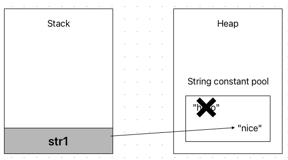

자바에는 문자열 관련 타입이 여럿 있다..
하나는 가장 흔히 쓰이고 자주 보이는 String 클래스이고, 나머지는 StringBuffer 클래스와 StringBuilder 클래스이다.

## 타입과 클래스
타입 얘기를 하다가 갑자기 왜 클래스라고 말하는 지 궁금할 수도 있다.
클래스. 즉 객체는 결국 타입이다. 쉽게 얘기하면 객체는 사용자 지정 타입인 것이다.
> 그렇다고 객체 == 타입은 아니다.
```java
int number = 3;
String text = new String("hello");
User user = new User();
```

자바에서 변수를 선언할 때는 타입 변수명 = 담길내용의 형식을 따른다. 위의 int, String, User는 타입 자리에 위치한다. 결국 User 객체와, String 객체는 int와 같이 타입이라는 것이다.

## String 클래스
문자열 리터럴 vs new String()
String은 가장 흔하게 사용하는 문자열 클래스(타입)이다.
```java
String str1 = "hello";
```

String은 객체이고, 객체는 원래 new로 생성해야한다. 하지만 String의 경우 예외적으로 new가 없이 큰 따옴표만으로도 사용할 수 있다. 이 경우 "hello"를 문자열 리터럴이라고 부르고, 자바의 String은 조금 특수하게 관리된다.

`String str1 = "hello"`가 실행되면 "hello"라고 하는 문자열 리터럴은 **문자열 상수 풀(String constant pool)**에 저장된다.


그렇다면 문자열 리터럴 방식이 아닌 new 연산자를 사용한 객체 생성 방식은 어떻게 메모리에 저장될까?

```java
String str2 = new String("hello");
```


new 연산자로 생성된 문자열 객체는 위 그림과 같이 문자열 상수 풀에 들어가지 않는다.
str1과 str2는 각각 다른 메모리 주소를 참조하고 있기 때문에 당연히 결과는 다음과 같다.

```java
System.out.println(str1==str2); // false
```
"hello" 문자열을 두 개만 더 만들어보겠다.

```java
String str3 = "hello";
String str4 = new String("hello");
```
모두 "hello"로 똑같아 보이는 문자열을 변수에 담았다. str3와 str4는 무엇을 참조할까?


그림 실력이 없는 점 양해바란다. 리터럴 방식으로 새로 선언 한 str3는 문자열 상수 풀에 존재하는 "hello"를 가리키고, new 연산자를 통해 생성한 str4는 또 새로운 String 인스턴스를 생성한다. 그림을 워낙 못 그렸으니 코드로 보자.

```java
	System.out.println(str1==str2); // false
    System.out.println(str1==str3); // true
    System.out.println(str2==str4); // false
```
문자열 리터럴로 선언한 str1과 str3는 문자열 상수 풀의 동일한 문자열 리터럴을 가리키게 되면서 identity(객체의 동일성, ==)가 동일해진다. 반면에, new 연산자로 생성한 str2과 str4는 서로 다른 객체를 가리키므로 동일성에 어긋난다.

물론 String에서 제공하는 equals() 메서드 (정확히 말하면 Object의 메서드를 동등성 확인을 위해 String 객체에서 오버라이딩함) 를 사용하여 동등성(equality)을 확인하면 모두 true가 출력될 것이다.

이렇듯 문자열 상수 풀이 동작하면서 동일한 문자열을 여러 번 생성하는 등의 메모리 낭비를 막을 수 있다.
이미 new 연산자를 통해 만들어진 String 객체의 경우, String에서 제공하는 intern() 메서드를 사용하면 문자열 상수 풀에 등록할 수 있다. void 메서드가 아니라 상수 풀에 등록한 String을 리턴하는 메서드이므로 반환하는 String 객체를 변수에 받아줘야한다.

### 불변(Immutable) 객체
자바에서 String은 불변 객체이다. 말 그대로 변하지 않는 객체이다.
String 문자열을 변경하거나, 합치거나, 자르거나, 어떤 변형을 주고자 할 때에도 그 객체가 변하는 것이 아니라 새로운 String을 생성하여 반환한다.

```java
String str1 = "hello";
str1 = "nice";
```         
이 경우 개발자 입장에서는 str1이라는 변수의 문자열이 "nice"로 변한 것처럼 보인다. 하지만 실제 메모리에서는 그렇지 않다.



기존에 "hello"를 가리키던 str1이 "nice"를 새로 가리키는 것이다. 이게 변하는 것 아니냐고? 이것은 객체가 변한 것이 아니라 변수에 저장된 메모리의 주소가 변경된 것이다. 원래 "hello"를 담고 있던 String 객체는 버려지고, 새로운 객체를 가리키는 것이다.
이러한 String 객체의 특징을 불변성 이라고 한다. 이러한 이유덕분에 문자열 상수 풀이 존재할 수 있다. 하지만 이러한 이유 때문에 해당 객체의 내용을 추가하거나 변경할 수 없다. 근데 나는 문자열 객체를 새로 만들지 않고 추가도 하고 문자를 빼기도 하고 싶다.
이 때 등장하는 것이 바로 StringBuffer 클래스이다.

## StringBuffer 클래스
StringBuffer 클래스는 String과 다르게 객체 내부적으로 문자열 편집이 가능하다. 이름 그대로 버퍼(buffer)를 가지고 있고, 인스턴스를 생성할 때 그 크기를 지정할 수 있다. 지정해주지 않을 시 기본은 16이다.

```java
	StringBuffer sb1=  new StringBuffer("hello");
    StringBuffer sb2=  new StringBuffer("hello");
    System.out.println(sb1.equals(sb2));
    System.out.println(sb1.toString().equals(sb2.toString()));
```
#### StringBuffer의 메서드
StringBuffer 클래스에는 문자열을 변경하기 위한 다양한 메서드들이 구현되어 있다.

```java
	StringBuffer sb1=  new StringBuffer("hello"); // StringBuffer 생성
	System.out.println(sb1.capacity()); // 21
	System.out.println(sb1.length()); // 5
	sb1.append(" nimoh"); // 문자열 가장 뒤에 문자열 추가
    sb1.append(2); // 문자열 가장 뒤에 정수 추가
	System.out.println(sb1); // hello nimoh2
	System.out.println(sb1.reverse()); // 2homin olleh
    sb1.append("heeeeeello");
    System.out.println(sb1.capacity());//44
```
#### Buffer 공간
sb1은 생성 시 버퍼의 크기를 따로 지정해주지 않았기 때문에 기본 16 + 저장된 문자열 수 만큼이 buffer의 공간이 된다. 그리고 문자열의 길이length()가 21을 넘어가자, buffer의 공간은 두 배로 증가한다. 44를 넘어가게 되면 그 때부터는 2배가 아니라 한 글자 추가될 때마다 한 칸 씩 늘어난다.

#### append()
StringBuffer의 append 메서드는 다양한 타입이 오버로딩되어있다.


(참조 : [자바 11 API 공식문서](https://docs.oracle.com/en/java/javase/11/docs/api/java.base/java/lang/StringBuffer.html))

`append()` 메서드는 StringBuffer 자기 자신을 객체를 반환한다. 덕분에 메서드 체이닝이 가능하다.
```java
	StringBuffer sb = new StringBuffer("hihi");
    sb.append(" nimoh").append(" is cool").append(" guy")";
```    
#### 문자열 비교
StringBuffer 클래스는 String 클래스와는 달리 equals() 메서드가 오버라이딩 되어있지 않다.
앞서 말했듯이 equals()는 모든 객체의 조상인 Object 클래스로부터 상속되어 내려오는 메서드이다. Object 클래스의 원조 equals() 메서드는 다음과 같다.


객체를 ==(동일성)으로 비교한다. 동일성 비교라는 것은 안에 문자열 내용이 같더라도 서로 다른 객체를 가리키면 false라는 뜻이다. 즉, StringBuffer 클래스는 equals()를 오버라이딩 하지 않았기 때문에 ==로 비교하나 equals()로 비교하나 똑같다는 말이다.

```java
StringBuffer sb1=  new StringBuffer("hello");
StringBuffer sb2=  new StringBuffer("hello");
System.out.println(sb1==sb2); // false
System.out.println(sb1.equals(sb2)); // false
```        
StringBuffer 클래스 간에 문자열을 비교하고 싶다면 어떻게 해야할까..?
다행히도 Object 클래스는 toString()를 가지고 있다. StringBuffer를 String으로 변환한 다음 하던대로 equals()를 통해 문자열을 동등성을 비교해주면 되겠다.

## Thread safe
StringBuffer는 멀티쓰레드로 부터 안전하다. 때문에 StringBuffer에 특정 값을 `append`하는 메서드를 여러 쓰레드에서 접근할 수 없다. 아래는 해당 코드이다.

```java
  // StringBuffer.java

  @Override
    public synchronized StringBuffer append(Object obj) {
        toStringCache = null;
        super.append(String.valueOf(obj));
        return this;
    }

    @Override
    @IntrinsicCandidate
    public synchronized StringBuffer append(String str) {
        toStringCache = null;
        super.append(str);
        return this;
    }
```
> 메서드 시그니처에 `synchronized`가 있으면 해당 메서드가 호출되면 락이 걸려 다른 쓰레드(혹은 인스턴스)에선 호출할 수 없다.
    
## StringBuilder
앞서 봤듯이, StringBuffer는 멀티쓰레드로 부터 안전하도록 동기화 되어있다. 

때문에 이러한 동기화 때문에 StringBuffer의 성능이 떨어지는 경우가 있을 수 있다. 이 때 사용하는 것이 StringBuilder 클래스이다.
```java
StringBuffer sb1=  new StringBuffer("hello");
StringBuffer sb2=  new StringBuffer("hello");
System.out.println(sb1.toString().equals(sb2.toString())); // true
```    
다만, StringBuilder 클래스의 경우 멀티쓰레드로부터 안전하지 않아, 멀티쓰레드에서 변경이 발생할 경우 데이터가 손상될 확률이 크다. 그리고 StringBuffer의 성능도 충분히 좋다. 따라서 성능향상이 반드시 필요한 경우가 아니라면 StringBuffer를 사용하는 것이 안전하고 좋다.