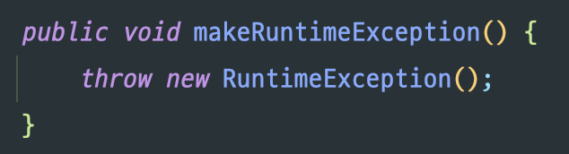
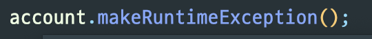

원활한 프로그램의 작동을 위해서는 예외처리는 필수적이다. 이번 포스팅에서는 자바에서 예외처리를 하는 방법에 대해 알아본다.
# 예외처리란?
자바에는 에러(Error)와 예외(Exception)가 있다. 에러는 하드웨어적인 문제로 오류가 발생하는 것인데, 개발자의 코드 작성으로는 어쩔도리가 없는 문제이다. 그와 달리 예외는 개발자가 코드로 어쩔도리 있는 문제이다. **예외**란 *사용자가 잘못 사용하거나, 코드로 인해 발생하는 문제*를 말한다.
## 예외의 종류
자바의 예외에는 **체크예외(혹은 일반예외)**와 **언체크예외(혹은 런타임예외)**가 있다.

### 체크 예외(Checked Exception)
체크 예외는 일반 예외(Exception)라고도 불리며 자바 파일이 컴파일 될 때 체크되는 예외이다. 체크 예외가 있으면 컴파일 할 수가 없으므로 **예외처리가 필수**이다.

이렇게 예외를 처리하라고 컴파일 에러가 발생하면 모두 체크 예외인 것이다.

RuntimeException을 제외하고, Exception와 이를 상속받는 예외들은 모두 체크 예외이다.

### 언체크 예외(Unchecked Exception)
언체크 예외는 실행 예외(Runtime Exception)라고도 불리며 자바 파일이 컴파일 될 때에도 체크되지 않는다. 즉, 예외처리를 하지 않아도 실행에는 문제가 없다.

RuntimeException와 이를 상속받는 예외들은 모두 언체크 예외이다.

## 예외처리
예외 처리란 예외를 잡아서 없애고 다른 로직을 실행하는 것이다.

### 체크 예외의 처리
체크 예외는 처리하지 않으면 컴파일 조차 못 하므로 꼭 처리해야하는 **중요한 예외**라는 의미로 사용된다.

최초의 체크 예외는 Exception의 자식 예외를 밖으로 떠넘기며 발생한다.

위에서 본대로 Exception은 체크 예외이기 때문에 컴파일에러가 발생했다. 
간단하게 체크예외를 처리해보자.

#### 1. try-catch 문 사용


try-catch문을 사용하여 예외를 잡아주고, 예외 메시지를 출력해주었다.
> 💡 예외를 처리할 때에 중요한 것이 있는데, 발생한 예외를 무시하지 않는 것이다. 예외를 처리하다보면 나중에는 어디서 발생한 무슨 예외인 지 알 수가 없다. 어떤 방법으로든 발생한 에러를 알려주자.

한 번에 여러 예외를 처리할 수도 있다.
방법은 다음과 같다.
##### 1. catch문 여러 개 작성
```java
	public void makeException() {
    	try {
        	throw new Exception();
            throw new RuntimeException();
        } catch (RuntimeException e) {
        	System.out.println(e.getMessage());
        } catch (Exception e) {
        	System.out.println(e.getMessage());
        }
    }
```
##### 2. 하나의 catch문 안에 여러 예외 작성
```java
	public void makeException() {
    	try {
        	throw new Exception();
            throw new RuntimeException();
        } catch (RuntimeException | Exception e) {
        	System.out.println(e.getMessage());
        }
    }
```


예외가 발생하는 메서드였지만 해당 메서드에서 처리해주었기 때문에 예외는 더 이상 호출하는 쪽으로 넘어오지 않는다.

#### 2. throws로 떠넘기기

예외를 호출하는 쪽으로 떠넘겨보자.

이렇게 되면 해당 메서드를 호출하는 쪽에서 try-catch로 예외를 처리해주거나 다시 떠넘겨야 한다.

> 떠넘길 예외가 여러개 일 경우에는 콤마(,)로 구분하여 작성해준다.
```java
	public void makeException() throws Exception, RuntimeException {
    	throw new Exception();
    }
```


### 언체크 예외의 처리
언체크 예외는 예외 처리가 필수는 아니다. 보통 개발자의 실수로 인해 발생하는 문제들이므로 미리 알고 처리하는 것이 쉽지 않다.


위와 같이 언체크 예외인 RuntimeException은 컴파일 에러가 발생하지 않는다. 

메서드를 호출하는 쪽에서도 예외가 넘어오지 않았다. 애플리케이션이 실행될 때 예외의 발생 여부를 알 수 있다. 그렇기 떄문에 언체크 예외는 실행 예외라 불리며, RuntimeException 클래스와 그 자식 예외 클래스들인 것이다.
언체크 예외도 예외 처리를 하는 방법은 체크 예외와 동일하다.

다만, 예외가 떠넘겨지더라도 호출하는 쪽에서 예외처리가 필수가 아니다.


그래도 실행 중에 예외가 발생하면 애플리케이션이 종료되므로 중요한 로직이나  예외처리를 해야한다고 생각되는 코드에는 예외 처리를 해주는 것이 일반적이다.

## 체크예외 -> 언체크예외
체크 예외는 예외를 처리해서 없애기 전까지 끊임없이 떠넘겨야 한다.
```java
throws -> throws -> throws -> throws...
```
예를 들어 A1, A2, A3, A4, A5 총 5개가 메서드가 있다.
A1에서 체크 예외를 생성하여 떠넘겼고 A1을 호출한 A2, A2를 호출한 A3....그렇게 예외가 A5까지 떠넘어왔다고 쳐보자. A5 메서드는 A1에서 발생한 예외를 꼭 확인하고 싶다.

A1, A2, A3, A4, A5를 호출하는 모든 메서드 혹은 생성자는 위에서 배운대로 체크 예외를 다시 떠넘기거나(throws) 예외 처리(try-catch)를 해서 예외의 고리를 끊어주어야 한다.

코드가 매우 난잡해지고 throws의 남발일 것이다.
이 때 할 수 있는 것이 체크 예외를 언체크예외로 변환시켜주는 것이다.


발생한 예외는 체크예외인 Exception 이지만, 예외를 잡아서 RuntimeException에 넣어 떠넘겼다. 체크 예외인 Exception이 언체크예외인 Exception로 변환된 것이다.
모든 예외는 생성자 매개변수로 다른 예외 객체를 받을 수 있다.


실제 발생한 예외는 체크 예외였지만, 메서드를 호출하는 쪽에서는 강제로 예외 처리하거나 다시 떠넘길 필요가 없어졌다.

# 마무리
개발자에게 예외 처리란 매우 매우 중요한 것이다. 포스팅 내용 이외에도 예외에 대해 공부할 것이 많으므로 더 해봐야할 것 같다.