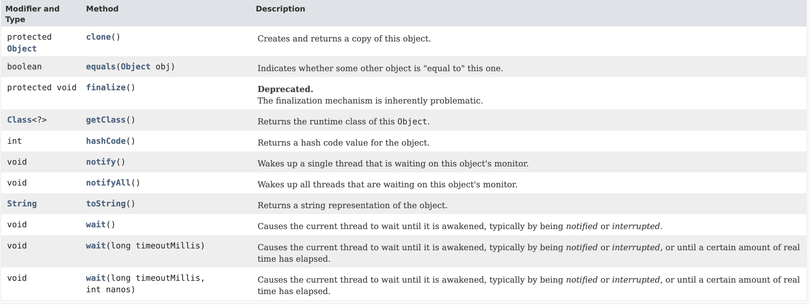

## 들어가며
동일성과 동등성에 대해 본격적으로 들어가기에 앞서 JAVA의 모든 객체의 최고 조상인 Object에 대해 먼저 알아본 뒤, 동일성과 동등성에 대해 알아본다.
## 모든 객체의 조상 Object
자바의 java.lang 패키지에 포함된 Object는 모든 객체의 조상이다.
보통 자바에서 상속을 하기 위해서는 아래와 같이 작성해야한다.
```java
	public class TestObject extends Object {
    	...
    }
```
하지만 예외적으로 Object는 모든 객체의 조상이므로 생략하더라도 Object의 자손이 된다.
```java
 public class TestObject {}
```
```java
public static void main(String[] args) {
       TestObject testObject = new TestObject();
       Object object = new TestObject(); // 컴파일 에러가 발생하지 않고 자동 형변환됨
       
       // testObject가 Object 객체의 인스턴스 인지 확인
       if (testObject instanceof Object) { 
           System.out.println("Object의 자손입니다.");
       }
}

// 결과
Object의 자손입니다.
```

위의 예제로 Object를 명시적으로 상속받지 않아도 상속된다는 것을 알아봤다.

### Object의 메소드

( 참조: [JDK 11 Document](https://docs.oracle.com/en/java/javase/11/docs/api/java.base/java/lang/Object.html) )

Object 클래스의 메소드 명을 쭉 보면 하나같이 뭔가 어디서 본 듯한 이름일 것이다. IDE를 사용할 때 어떤 객체든지 이 메서드들을 상속받아 접근할 수 있기 때문에 객체에 .을 찍고 자동완성 추천목록에서 종종 보았을 것이다.

Object의 메소드 리스트를 보여준 것은 다름아닌 **`equals()`와 `hashCode()` 때문이다.** 

## equals()와 hashCode()
Object 객체의 `equals()`와 `hashCode()`는 객체의 동일성(identity), 객체의 동등성(equality) 를 비교할 수 있는 메서드이다.

### 동일성? 동등성? 그게 뭐가 달라?
여기서 말하는 **객체의 동일성이란 A 객체와 B 객체가 주소가 다르다**는 것이다. 주소가 다르다는 것은 근본적으로 다른 객체(인스턴스)라는 것을 의미한다.
```java
	TestObject testObject1 = new TestObject();
    TestObject testObject2 = new TestObject();
```
이렇게 두 개의 TestObject가 생성(인스턴스화)되었다면 같은 클래스의 객체를 생성했지만 서로 다른 인스턴스로서 메모리에 생성되기때문에 동일성이 어긋난다고 할 수 있다.

그렇다면 동등성은 무엇일까?
가장 대표적인 동등성 비교의 예로 String을 들 수 있다.
```java
	// 보통 String은 new로 생성하지 않는 것이 일반적이다. 예시를 위해 new로 생성한다.
	String test1 = new String("test");
    String test2 = new String("test");
```
TestObject와 마찬가지로 String을 각각 생성(인스턴스화) 하였다. 둘은 메모리 상 따로 생성되기 때문에 주소가 다르다. 즉 동일성이 어긋난다. 하지만 공통적으로 "test"라는 문자열을 가지고있다. 이는 동등성이 같다는 것이다. 
동등성이란 동일성이 어긋나더라도 각각의 객체에서 정의하는 규칙에 부합한다면 동등한 객체로 보는 특성이다.

### equals()의 재정의
`String` 객체 내부에 문자열이 같으면 동등하다는 것은 알겠는데 왜 그게 되는 지 궁금할 것이다. 그 전에 Object의 equals()를 먼저 알아보자.
```java
	public boolean equals(Object obj) {
        return (this == obj);
    }
```
위 코드는 실제로 Object 클래스에 선언된 `equals()` 메서드이다.
메서드 내용을 보면 현재 인스턴스와 매개변수 객체가 동일한지 여부를 반환한다.
> 💡 자바에서 == 는 동일성을 비교하는 연산자이다.

자바를 몇 번 다뤄보았다면 알다시피 문자열의 비교는 `equals()`로 한다. 
```java
	String test1 = new String("test");
    String test2 = new String("test");
    test1.equals(test2); // true
```
이것이 가능한 이유는 String 클래스에서 조상인 Object의 equals 메서드를 객체의 동일성이 아니라 문자열로 비교하여 결과를 반환하도록 **재정의(Overide)**하고있기 때문이다.

이처럼 객체의 동등성을 비교하기 위해서는 `equals()` 를 재정의해야한다. 재정의하지 않고 `equals()`를 사용하면 동일성 검증이기때문에 인스턴스의 주소값을 비교할 뿐이다.
```java
public class Student {
	private String name;
    private int no;
    
    public Student(int no, String name) {
        this.no = no;
		this.name = name;
    }
    
    // getter 생략
		
    @Override
    public boolean equals(Object obj) {
	    // 매개변수 객체가 Student의 인스턴스인 지 확인
    	if(obj instanceof Student) {
        	Student target = (Student) obj;
       	    return target.getName().equals(name) && target.getNo() == no;	
        }
        return false;
    }
}
```

위의 학생 클래스에서 equals()를 이름과 번호 필드를 가지고 있으며 이름과 번호가 같으면 **동등**하다고 재정의했다.

```java
		Student s1 = new Student(1, "홍길동");
        Student s2 = new Student(2, "니모");
        Student s3 = new Student(1, "홍길동");

        System.out.println(s1.equals(s2)); // false
        System.out.println(s1.equals(s3)); // true
        System.out.println(s1 == s3); // false
```
각각의 Student 객체는 모두 다른 주소를 가지고 있으므로 동일성은 모두 어긋난다.
`(s1 == s3) -> false`
하지만 s1과 s3는 번호와 이름이 **동등**하기 때문에 재정의한 `equals()`를 사용하여 비교하면 `true`를 반환한다.

### hashCode()의 재정의
`hashCode()`는 `equals()`와 마찬가지로 객체의 동등성을 확인하기 위한 메서드이다. 객체 내부 메모리 주소를 사용해서 해시코드를 계산하여 반환한다. 반환받은 정수를 비교해야한다. 자바의 Object 클래스의 hashCode 메서드는 기본 구현이 공개되어있지 않다. 재정의하지 않은 `hashCode()`는 재정의하지 않은 `equals()`와 마찬가지로 객체의 동일성을 체크한다.

```java
        Student s1 = new Student(1, "홍길동");
        Student s2 = new Student(2, "니모");
        Student s3 = new Student(1, "홍길동");

        System.out.println(s1.hashCode()); // 1239731077
        System.out.println(s2.hashCode()); // 557041912
        System.out.println(s3.hashCode()); // 1134712904
```
현재 Student 클래스는 hashCode()를 재정의하지 않았기 때문에 객체의 메모리 주소를 가지고 해시코드를 반환한다. 즉 `==` 과 재정의되지 않은 `equals()`와 동일하게 작동한다. 
hashCode() 메서드는 Hash 관련 자료구조(컬렉션)를 사용할 때 필수이므로 재정의해줘야한다.
```java
	@Override
    public int hashCode() {
        int hashCode = no + name.hashCode();
        return hashCode;
    }
```

### equals()와 hashCode() 재정의 시 주의할 점
`equals()`와 `hashCode()`는 일관성을 유지해야한다. 즉, `equals()`가 true를 반환한다면 두 객체의 hashCode()의 결과값 역시 동일해야한다. 만약 그렇지 않다면 Hash 기반 자료구조를 사용할 때 문제가 발생한다. Hash 기반 자료구조에서는 객체를 검색하거나 제거하는 등의 동작을 수행할 때, 해당 객체의 `hashCode()`를 가지고 객체를 찾는데, equals만으로 동등성을 체크하면 이 부분에서 예상치못한 문제가 발생할 수 있다.

## 나가며
오늘은 equals()와 hashCode()를 사용한 객체의 동등성 검사에 대해 알아보았다. 웬만하면 두 메서드를 재정의 해주는 것이 좋고, 일관성을 유지할 수 있도록 클래스를 정의해야한다.