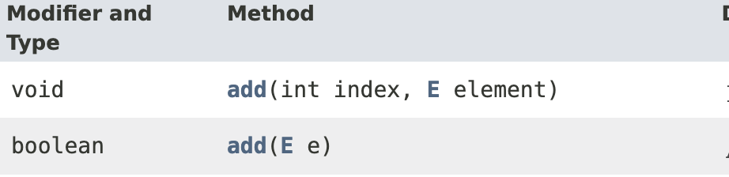

## ArrayList에는 무슨 타입이 들어갈까?
ArrayList에 대해 공부하던 중 문득 궁금한 것이 생겼다.
[Java 공식 문서(11)](https://docs.oracle.com/en/java/javase/11/docs/api/java.base/java/util/ArrayList.html)에 따르면 ArrayList의 add 메서드는 객체를 매개변수로 받아 ArrayList에 추가한다. 아래의 공식문서에서 알려주는 ArrayList의 모든 add 메서드이다.


보다시피 int값을 index로 받고 객체를 받아 저장하거나, 객체만을 받아 ArrayList에 추가한다.
여기서 하나 궁금증이 생긴다. 객체라는 것은 클래스로 인해 만들어진 인스턴스를 말하는 것이다. 그렇다면 원시타입(int, boolean, double, char, long ...)은 ArrayList에 들어갈 수 없는 것인가?
## 직접 해보기
```java
ArrayList list = new ArrayList(10);
int a = 1;
boolean b = true;
char c = 'b';
long d = 1L;
list.add(a);
list.add(b);
list.add(c);
list.add(d);
System.out.println(list);
```
ArrayList를 하나 생성하고 그 사이즈를 10으로 초기화해주었다. 그리고 다양한 원시타입을 추가해주었다. 결과는 어떻게 나올까?
```java
[1, true, b, 1]
```
성공적으로 들어갔다. **사실 이렇게 제너릭없이 사용하는 방법은 권장하지 않는다. 실험을 위한 것이므로 실제로는 이렇게 사용하지 말자.**

## 왜 될까?
제너릭으로 Wrapper 클래스를 넣어준 것도 아니고 객체로 변환해서 넣어주지도 않았는데 원시타입으로 선언한 변수들이 ArrayList에 잘 들어갔다. 이유가 궁금하다.

ArrayList의 add 메서드에 원시 int 타입이 사용한다고 Integer(Wrapper class)로 자동 변환되지는 않는다. 대신, int 타입이 ArrayList의 add 메서드에 매개 변수로 사용되면 자바 컴파일러는 Wrapper 클래스의 객체가 필요하다고 예상되는 컨텍스트에서 int값을 Integer 객체에 넣어주는 코드를 삽입한다.
> 💡 이러한 경우를 Auto Boxing 이라고 한다.


```java
ArrayList list = new ArrayList(10);
int a = 1;
list.add(Integer.valueOf(a));
System.out.println(list);
```
위 코드는 자바 컴파일러로 변환된 바이트코드를 다시 디컴파일한 코드이다.
분명 `add(a)`만 해주었으나 컴파일단계에서 `Integer.valueOf(a)`로 감싸주었다. `int` 뿐만 아니라 다른 원시타입도 마찬가지이다. 모든 원시타입들은 각각 Wrapper 클래스를 가지고 있고, 자동으로 컴파일러가 Wrapper 클래스로 감싸준다.

## new Integer()와 Integer.valueOf()

간혹 `add(new Integer(a))` 처럼 박싱해서 넣는 경우가 있다. 
`new` 연산자를 사용하여 Wrapper 객체를 생성하는 것은 Java 9 버전 이후로 deprecated 되었다. 이유는 `new` 로서 생성하는 것 보다 `Integer.valueOf(1)` 처럼 사용하는 것이 메모리면에서 효율적이라는 이유이다.
`new`로 생성하면 매번 새로운 객체를 힙 메모리에 생성한다. 하지만 `Integer.valueOf()` 를 사용하면 이미 캐시되어 있는 정수 -127 ~ 127까지는 새로운 생성없이 그대로 리턴해준다.

```java
Integer a = Integer.valueOf(127);
Integer b = Integer.valueOf(127);
Integer c=  new Integer(127);
System.out.println(a==b); // true
System.out.println(b==c); // false
```
문자열 상수 풀과 비슷하게 자주 사용될 수 있는 작은 수 -127부터 +127까지는 이미 메모리에 저장되어 꺼내쓰기만 할 수 있는 것이고, 해당 범위를 넘어가게 되면 그 때는 새로운 객체를 생성하여 리턴한다.
사실상 `Short.valueOf()` 타입과 동일한 것이다. 하지만 `Short.valueOf()`를 사용할 경우와 `Integet.valueOf()`를 사용하는 경우는 127에 상관없이 수의 크기면에서 다르다. 잘 알 것이라 생각한다.
```java
 // Integer 클래스의 valueOf 메서드
 public static Integer valueOf(int i) {
		 	// -127 <= i <= 127 이라면 캐시되어 있는 정수를 리턴
        if (i >= IntegerCache.low && i <= IntegerCache.high)
            return IntegerCache.cache[i + (-IntegerCache.low)];
            // 범위를 초과할 시 new로 새로운 객체 생성
        return new Integer(i);
 }
```
***Integer 뿐만아니라 다른 Wrapper 클래스들도 마찬가지이다.***

Java9 버전 이상에서는 웬만하면 Wrapper 객체를 생성할 때 valueOf()를 사용하도록 하자. 범위를 넘지 않으면 메모리 이득이고 아니면 뭐 생성이니 밑져야 본전인 셈이다.