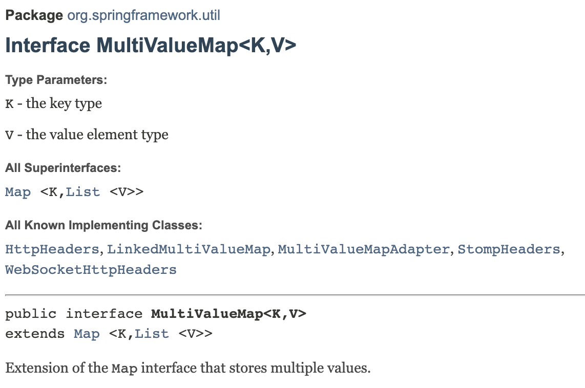

## MultiValueMap과의 첫 만남
SpringBoot 토이 프로젝트를 진행하던 중 MultiValueMap이라는 인터페이스를 만났다.
만난 장소는 Controller의 테스트코드였다.
RestController를 테스트하기 위해서는 아래와 같이 mockMvc 객체의 perform 메서드를 통해 HTTP 요청의 url과 헤더,바디, 파라미터 등을 임의로 지정하여 테스트해야한다.

```java
ResultActions resultActions = mockMvc.perform(
                MockMvcRequestBuilders.get(url)
                        .params(linkedMap)
        );
```
테스트를 하려는 api에 쿼리스트링(RequestParam)을 두 개 넣어줘야했기 때문에 MockMvcRequestBuilders 객체에 있는 params 메서드를 사용하고자 했다. 쿼리스트링은 키와 값으로 되어있으므로 당연히 Map의 구현체를 인자로 할 줄 알았지만 params()라는 녀석은 MultiValueMap이라는 인터페이스의 구현체를 요구했다. 그게 뭔데 친구야...?

MultiValueMap 이란?
MultiValueMap 인터페이스는 자바 API문서에서는 찾아볼 수 없었고, 스프링 API문서에서 찾을 수 있었다. 자바에 기본 내장된 인터페이스가 아니라 스프링에서 제공하는 인터페이스라는 것을 알 수 있었다.

[스프링 공식문서](https://docs.spring.io/spring-framework/docs/current/javadoc-api/org/springframework/util/MultiValueMap.html)

> Extension of the Map interface that stores multiple values. ( Spring api )
-> 여러 값을 저장하는 맵 인터페이스의 확장

스프링 API에서 MultiValueMap을 위와 같이 설명했다. 설명에 적힌 바와 같이 Map 인터페이스를 상속받고 있었다. 영어를 단순 해석한 탓인지 쉽게 이해할 수는 없었다. 기존 Map과의 차이점을 이해해보고자 직접 사용해보았다.

### 기존 Map과 차이점
위의 공식문서를 자세히보면 MultiValueMap이 Map 인터페이스를 상속할 때 Value값을 List로 감싼 채로 상속받는 것을 볼 수 있다. 이 말은 즉 하나의 Key와 하나 이상의 value로 이루어진 리스트를 쌍으로 받겠다는 말이다.
이를 실험하기 위해 실행해보면 결과는 다음과 같다.

```java
Map<String, Integer> basicMap = new HashMap<>();
		MultiValueMap<String,Integer> multiValueMap = new LinkedMultiValueMap<>();
		basicMap.put("test",1);
		basicMap.put("test",2);
		multiValueMap.add("test",1);
		multiValueMap.add("test",2);
		System.out.println("basicMap = " + basicMap);
		System.out.println("multiValueMap = " + multiValueMap);
        
        => 실행결과
        multiValueMap = {test=[1, 2]}
		basicMap = {test=2}
```
		
일반적인 Map을 구현한 HashMap의 인스턴스인 basicMap은 Key가 중복될 수 없다. 따라서 마지막으로 put된 basicMap.put("test",2)가 최종적으로 Map에 저장된다.
multiValueMap은 put은 아니지만 add를 하는 경우에 Key값이 중복되면 해당 Key값에 List로 모두 들어가는 것을 볼 수 있다.

또한, MultiValueMap은 put도 가능하다

```java
MultiValueMap<String,Integer> multiValueMap = new LinkedMultiValueMap<>();
		// 정수가 담기는 리스트를 생성
        List<Integer> intList = new LinkedList<>();
		// 리스트에 1,2,3 추가
		intList.add(1);
		intList.add(2);
		intList.add(3);
		multiValueMap.put("putTest",intList);
		System.out.println("multiValueMap = " + multiValueMap);

		=> 실행결과
        multiValueMap = {putTest=[1, 2, 3]}
```

MultiValueMap의 put은 value값에 List를 요구한다. 따라서 만들어진 List를 인자로 한 번에 줄 수 있다.

주의사항
이라기 보다 MultiValueMap 인터페이스는 스프링 프레임워크에 내장된 것이므로 일반 자바환경에서는 사용할 수 없다. 일반 자바 환경에서 연습해보려다가 안돼서 화내는 일은 없길 바란다.