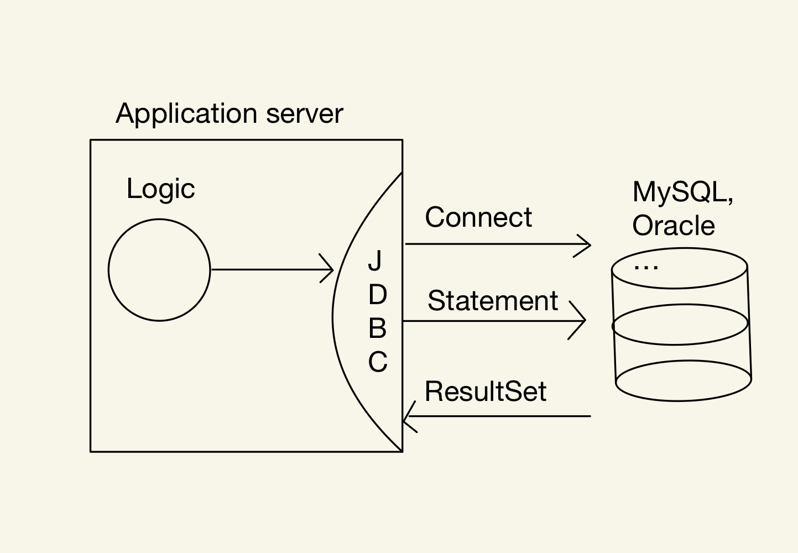

## 데이터베이스 연결
자바에서 데이터베이스에 연결하려면 다음과 같은 작업이 필요하다.

**Connection**는 DB와 TCP/IP 통신을 통해 연결되는 것이고, **Statement**는 SQL문을 전달하는 것, **ResultSet**은 DB로 부터 데이터를 조회하는 것을 말한다.

현재는 DB라고 그려놨지만 해당 DB가 MySQL 이라면 어떨까? 

큰 틀의 변화는 없지만 MySQL 전용 Connection, Statement, ResultSet이 필요하다. 아마 오라클로 변경하더라도 오라클 전용 Connection, Statement, ResultSet으로 Oracle DB와 연결하여 사용될 것이다. 이렇듯 각 데이터베이스는 틀은 같지만 연결, 쿼리 전달, 데이터 조회하는 구체적인 방법(코드)은 모두 다르다.

하지만 여기서 중요하게 봐야할 것은 바로 **큰 틀이 변하지 않는다는 것**이다. 구체적인 방법(메서드)는 DB마다 변하지만 큰 틀(메시지)은 변하지 않는다.
우리는 이렇게 개념적으로 비슷한 것들을 뽑아내는 것을 **추상화** 라고한다. 
MySQL이나 Oracle이나 Postresql이나.. 어차피 다 연결,쿼리전달, 응답받기를 똑같이 할텐데 추상화해서 다 같이 사용하면 안될까?

그 고민의 결과가 바로 **JDBC** 이다.
# JDBC란?
JDBC(Java Database Connectivity)는 자바를 사용할 때, 데이터베이스 연결을 도와주는 인터페이스이다. 위의 그림에서는 실제로 해당 DB에 접근, 쿼리, 결과 응답을 받았지만 JDBC는 DB의 종류와 상관없이 이 행위들을 추상화 하였다.

JDBC는 크게 위에서 알아봤던 `Connection`, `Statement`, `ResultSet`를 추상화하여 가지고있다. 이제 개발자는 DB에 접근할 때, MySQL, Oracle 등의 각각의 DB 접근방법을 따로 사용할 필요 없이 JDBC API만 사용하면 해당 DB에 접근을 하게 되어 OCP 원칙을 지킬 수 있게 되었다.

그런데 추상화했다는 것은 즉, 실제 구현이 되어있지 않다는 것이다. 그렇다면 JDBC에 접근은 어떻게 하는 걸까?

## JDBC 드라이버
우리는 인터페이스를 만들어 사용하려면 그 구현체가 반드시 필요하다. 인터페이스는 말 그대로 개념적으로 추상화된 메시지들의 모임일 뿐 실제로 작동하진 않는다. 그렇다고 이 JDBC 인터페이스를 DB 별로 구현해버리면 될까? 아니다. 이러한 구현체들은 DB 벤더에서 모두 제공해준다.

이 구현체들이 바로 한 번쯤은 들어봤을 JDBC 드라이버이다. 만약 MySQL을 사용하려면 MySQL에서 Driver를 다운받아야하고, Oracle을 사용하려면 Oracle Driver를 다운받아 사용해야 한다. 드라이버를 다운받아 라이브러리로 등록하기만 하면 JDBC를 구현한 해당 드라이버를 사용할 수 있다.
이 때는 `DriverManager`를 통해 커넥션을 가져오면 된다.

# 커넥션 풀 (Connection pool)
## 커넥션
위의 그림에서는 애플리케이션 서버에서 DB에, 혹은 JDBC에서 DB로 곧장 접근하는 것으로 설명했지만 사실 DB와 애플리케이션 서버 사이에는 한 단계가 더 있다. 바로 **커넥션**이다.

커넥션을 통해 DB에 접근하게 되면 DB는 **세션**을 만들고 커넥션과 연결된다. 즉, 한 커넥션 당 하나의 세션을 가지게 된다.

그런데 DB도 하나의 프로세스이기 때문에  커넥션을 통해 DB와 연결하는 것은 TCP/IP 통신으로 이루어진다. 만약 DB에 접근해야하는 로직을 수행한다면 10번 수행하면 10번 모두 TCP/IP 통신(3 way handshake)을 하여 매우 비효율적일 것이다. 또, 접근할 때마다 통신을 하면 속도적인 측면에서도 아쉬운 점이 있을 것이다.

그렇다면 이렇게 생각해볼 수 있다.
> 미리 여러 개 연결해놓고 그냥 그 커넥션 쓰면 안되나? 왜 굳이 쓸 때마다 연결했다 끊었다 해야하는거야...?

맞다. 그렇게 하면된다. 그게 바로 커넥션 풀이다.

## 커넥션 풀이란?
Connection Pool은 말 그대로 커넥션의 수영장이다. 좀 이상한가? 어찌됐든 커넥션이 옹기종기 모여 있는 풀장 같은 느낌이라고 생각하면 된다.

이 커넥션 풀은 애플리케이션이 실행될 때, 정해진 최대 커넥션 수 만큼 미리 DB와 연결하여 커넥션을 가지고 있는다.

 
> 형편없는 그림을 이해해주길 바랍니다..

이렇게 커넥션이 여러 개 생성되고, DB에도 각 세션에 연결된 상태로 애플리케이션이 시작된다. 

이렇게 되면 이제 DB에 접근할 때마다 새로 TCP/IP 연결을 할 필요가 없다. 
주의할 점은 커넥션 풀은 빌려갔다가 반납하는 것이다. 따라서 사용한 커넥션의 연결을 끊어버리는 것이 아니라 **반납**해야한다.

## 종류
커넥션 풀은 보통 오픈소스이며 다양한 커넥션 풀이 있는데, 스프링은 Spring boot 2.0 버전 이후로 HikariCP를 채택하여 기본 커넥션풀로 사용하고 있다.

# 데이터소스(Datasource)
DB에 접근하는 방법은 `DriverManager`를 통해 커넥션을 직접 가져오거나 커넥션 풀을 사용하여 커넥션을 빌려오는 방법이 있다. 커넥션 풀도 HikariCP, tomcat-jdbc pool등 여러 커넥션 풀이 있을 것이다.만약 커넥션을 가져오는 방법이 바뀐다면 클라이언트 코드를 모두 변경해야하는 대참사가 나타날 것이다.

앞서 DB접근을 추상화하는 JDBC를 알아보았다. 그렇다면 커넥션을 가져오는 행위를 추상화할 순 없을까? 바로 **데이터소스**이다.

Datasource는 커넥션을 가져오는 행위 그 자체를 추상화하였다. 정리하면 애플리케이션 서버에서 DB에 접근하는 것을 JDBC가 추상화하였고, 접근한 뒤 커넥션을 가져오는 것을 추상화한 것이 Datasource이다. 

Datasource만 의존하면 실제로 커넥션을 가져오는 방법이 `DriverManager`든 `HikariCP`든 상관없다. 클라이언트 코드는 바뀔리가 없다는 것이다. 이 추상화 역시 OCP원칙을 지키게 된다.

# 정리
오늘은 자바와 스프링이 DB에 어떻게 연결하고, 어떻게 쿼리를 수행하고 결과를 받는 지에 대한 근본적인 방법에 대하여 간략하게 알아보았다. 
요약하자면 **DB 종류 별 접근방법을 추상화한 것이 JDBC**, **DB와 연결된 후 커넥션을 가져오는 방법을 추상화한 것이 Datasource** 이다.
각 방법으로 DB에 쿼리를 보내고, 응답을 받고, 자원을 릴리즈하는 코드를 넣을까 하다가 사실 코드보다 중요한 것이 이 큰 개념이라고 생각하여 넣지 않았다.

자바와 스프링은 어떤 개념을 추상화를 해가면서 발전한다. 추상화를 한다는 것은 결국 코드나 설계가 좀 더 객체지향적으로 변한다는 것 같다.
이 글에서 나온 JDBC와 Datasource 두 개만 보더라도 확장성있는 시스템이 되려면 객체지향의 원칙 중 하나인 OCP(Open-closed Principle)를 지키는 것이 중요하다고 생각된다.