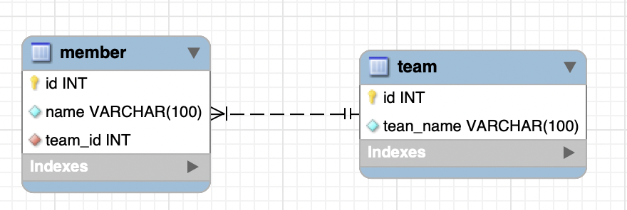
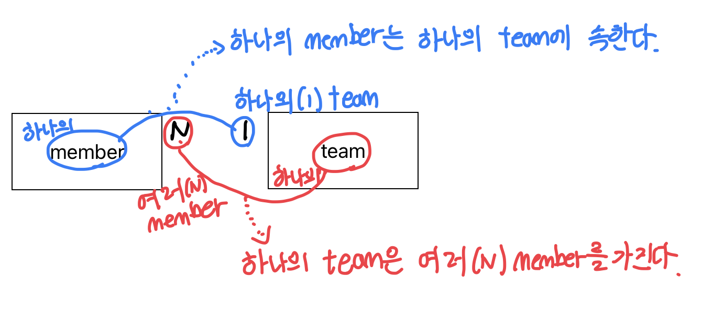

## 연관관계
JPA 뿐만 아니라 관계형 데이터베이스에는 기본적으로 테이블간 연관관계가 존재한다. 

아래는 멤버와 팀의 연관관계를 나타낸 ERD(Entity Relationship Diagram) 이다.



> ERD에 대한 자세한 얘기는 생략하겠다. 간단하게 얘기하자면 이는 IE 표기법으로 작성된 ERD인데, 사진을 보면 테이블 끼리 까마귀 발처럼 생긴 것이 선으로 연결되어있다. 따라서 해당 표기법은 Crow-feet 표기법 이라고도 한다.

IE 표기법에서는 일대다(1:N), 다대다(N:M), 다대일(N:1) 등에서 '다' 쪽에 까마귀 발이 붙는다. 반대로 '일' 쪽에는 선과 교차하는 짧은 선을 통해 1이라는 것을 나타낸다.

이를 토대로 위의 사진을 해석하자면 member와 team은 N:1(다대일) 관계이다. 풀어서 말하면 **하나의 member**는 **하나의 team**에 속하고, 반대로 **하나의 team**은 **여러 member**를 가진다는 것이다. 

일대다든 다대다든 다대일이든 위와 같은 방법으로 읽으면 된다.



## JPA의 연관관계
### 패러다임 불일치
JPA는 ORM(Object Relational Mapping)이다. 말 그대로 객체와 관계형 DB를 매핑해주는 역할을 하기 때문에 당연히 관계형 DB의 연관관계를 사용할 수 있다. RDB의 경우 연견관계를 SQL로 작성하는데, JPA의 경우 연관관계를 자바 코드 작성할 수 있다.

- RDB의 연관관계 지정
```sql
CREATE TABLE member (
	id int not null auto_increment,
    name varchar(100) not null,
    team_id int not null,
    primary key(id),
    foreign key (team_id) references team(id) /* 외래키 지정 */
);
```

- JPA의 연관관계 지정
```java
@Entity
public class Team {

    @Id
    @GeneratedValue
    private Long id;

    private String name;

}


@Entity
public class Member {

    @Id
    @GeneratedValue
    private Long id;

    private String name;

    @ManyToOne // 다대일 연관관계
    @JoinColumn(name = "team_id")
    private Team team;
    
}
```

위의 예제코드를 보면 RDB의 연관관계와 JPA의 연관관계에서 눈여겨볼 다른 점이있다. 바로 무엇을 매핑하냐는 것이다.
RDB는 `team_id`를 외래키(참조키)로 하여 `member` 테이블을 생성했다. JPA의 경우는 `Team` 엔티티 그 자체를 참조하고 있다. 

RDB와 자바의 패러다임 차이로 인해 발생하는 차이라고 볼 수 있다. 만약 JPA에서 `team_id`로 매핑한다면, 다음과 같은 코드를 작성해야할 것이다.
```java
Member findMember = em.find(Member.class, memberId);

Long teamId = findMember.getTeamId;

Team findTeam = em.find(Team.class, teamId);
```

이 경우 단지 `Member`가 속해있는 `Team`을 가져오고 싶었는데 이를 위해 `Member`를 찾아 `teamId`를 가져오고 이를 사용해 `Team`을 가져오는 번거로운 작업이 필요하다.

그렇다면 JPA에서는 어떻게 사용할까?

```java
Member findMember = em.find(Member.class, memberId);

Team findTeam = findMember.getTeam();
```
끝이다. `Member` 엔티티는 `Team` 엔티티 자체를 참조하고 있기 때문에 그래프 탐색을 통해 간단하게 연관관계에 있는 엔티티를 가져올 수 있다.

> 물론 N+1 등의 문제는 해결할 필요가 있다.

### 단방향 매핑, 양방향 매핑
RDB의 경우에는 테이블간에 연관관계가 맺어져 있다해도 방향은 없다. 
```sql
select
    *
from
    member m
join
    team t
on
    m.team_id = t.id;

---

select
    *
from
    team t
join
    member m
on
    t.id = member.team_id;    

```

하지만 JPA 연관관계에는 방향이 있다.
이 역시 JPA와 RDB의 패러다임 불일치에 해당한다. JPA 연관관계에서 방향이 무엇인 지 알아보자.

예제를 쉽게하기 위하여 위에서 봤던 `Member`와 `Team`을 다시 살펴보자.

```java
@Entity
public class Team {

    @Id
    @GeneratedValue
    private Long id;

    private String name;

}


@Entity
public class Member {

    @Id
    @GeneratedValue
    private Long id;

    private String name;

    @ManyToOne // 다대일 연관관계
    @JoinColumn(name = "team_id")
    private Team team;
    
}
```

위의 연관관계는 `Member` -> `Team`의 **단방향** 연관관계이다. `Member`가 `Team`를 참조하여 `Member`에서 `Team`으로 접근가능하기 때문이다.
반대방향이 되면 다음과 같을 것이다.
```java
@Entity
public class Team {

    @Id
    @GeneratedValue
    private Long id;

    private String name;

    @OneToMany
    @JoinColumn(name = "team_id")
    List<Member> memberList = new ArrayList<>();

}


@Entity
public class Member {

    @Id
    @GeneratedValue
    private Long id;

    private String name;
    
}
```

그렇다면 양방향은? 맞다.

둘을 합치면 양방향이다.
```java
@Entity
public class Team {

    @Id
    @GeneratedValue
    private Long id;

    private String name;

    @OneToMany(mappedBy = "team")
    List<Member> memberList = new ArrayList<>();

}


@Entity
public class Member {

    @Id
    @GeneratedValue
    private Long id;

    private String name;

    @ManyToOne
    @JoinColumn(name = "team_id")
    private Team team;
    
}
```

양방향 매핑에서는 주의할 점이 있다.

생각해보면 DB에서 참조키(외래키)는 연관된 두 테이블 중 하나의 테이블만 가진다. 그렇다면 위의 양방향 연관관계 매핑에서 참조키는 누가 가지고 있을까? 이 문제는 바로 ***연관관계의 주인***에 대한 얘기로 직결된다.


### 연관관계의 주인
연관관계의 주인. 즉 외래키를 가지고,  연관관계를 쥐락펴락할 수 있는 주인은 `Member`와 `Team` 중 누구일까?

RDB에서는 일대다, 다대일의 경우 무조건 '다' 쪽에서 참조키를 가진다. 곰곰이 생각해보면 납득될 것이다. 하나의 팀이 어떻게 하나의 선수만을 가질텐가.

단방향 연관관계라면 연관관계의 주인을 알아보는 것은 크게 어려움이 없다. 서로를 참조하고 있는 엔티티( `@ManyToOne` 등을 사용하고 있는 엔티티 )가 연관관계의 주인이다.

양방향 연관관계라면 좀 더 자세히 봐야한다.

위의 `Team` 엔티티를 다시 보자.
```java
@Entity
public class Team {

    @Id
    @GeneratedValue
    private Long id;

    private String name;

    @OneToMany(mappedBy = "team") // <<여기
    List<Member> memberList = new ArrayList<>();

}
```

`Team`객체에서 `Member`를 매핑할 때, 매핑 애노테이션에 `mappedBy`라는 파라미터를 넣었다. 
`mappedBy`. 누군가에 의해 매핑되었다는 것이다. 즉, `Team`이 연관관계를 매핑한 것이 아니라는 말이므로 `Team`은 연관관계의 주인이 아니다. 따라서 이 관계에서는 `Member`가 연관관계의 주인이다.


JPA는 연관관계의 주인이라는 것을 통해 참조키를 쥐락펴락한다.
연관관계의 주인인 엔티티만이 해당 연관관계를 수정할 수 있다. 반대로 말하면 연관관계의 주인이 아니면 연관 엔티티에 대하여 조회만 할 수 있다.

연관관계의 주인을 생각하지 못한 채 양방향 연관관계를 사용하면, 실수나 예상치 못한 결과에 고통받을 수도 있다.

간단한 예를 들어보자.
```java
 @Test
  void direction() {
      Member member = new Member("nimoh");
      em.persist(member); // member 영속

      Team team = new Team("giants");
      List<Member> memberList = team.getMemberList();

      memberList.add(member);   // Team의 memberList에 member 추가

      em.persist(team);

      em.flush();
      em.clear();

      Member findMember = em.find(Member.class, member.getId());

      assertThat(findMember.getTeam()).isNull(); // 성공

  }
```
분명히 `team`을 영속할 때 member를 추가해주었지만 실제로 수행된 쿼리는 다음과 같다.
```bash
insert into member (name,team_id,id) values ('nimoh',NULL,1);
```

문제는 연관관계의 주인인 `Member`가 아닌 `Team`이 `Member`를 본인의 필드에 add 함으로써 사실 상 아무것도 하지 못한 것이다.

그렇다면 연관관계의 주인인 `Member`에게 `Team`을 넣어보자.

```java
  @Test
  void direction_member() {
      Team team = new Team("giants");
      em.persist(team); // team 영속

      Member member = new Member("nimoh");
      member.setTeam(team); // Member에 Team 추가
      em.persist(member); // member 영속

      em.flush();
      em.clear();

      Member findMember = em.find(Member.class, member.getId());

      assertThat(findMember.getTeam()).isNotNull();  // 성공
  }
```
이번에는 `Member`에 `Team`을 넣어주었다. 쿼리는 다음과 같이 실행됐다.
```bash
insert into member (name,team_id,id) values ('nimoh',1,1);
```
이번에는 `team_id`가 잘 매핑되어 쿼리가 수행되었다.

이렇듯, 양방향 매핑의 경우 연관관계의 주인에 매핑이 참조되어야 원하는대로 동작한다. 이 경우 어디에 넣어야하는 지 헷갈릴 수 있는데, 김영한님 같은 경우 엔티티에 메서드를 하나 만들어서 양방향을 모두 관리할 수 있게 하였다.

```java
public class Member {
    ...
    
    public void changeTeam(Team team) {
        this.team = team;
        team.getMemberList().add(this);
    }
}

public class Team {
    ...
    public void addMember(Member member) {
        memberList.add(member);
        member.setTeam(this);
    }
}
```
이렇게 하면 개발자가 편한 방법으로 쉽게 양방향 매핑을 사용할 수 있다.

## 정리
JPA는 RDB와의 패러다임 불일치를 해결하는 여러 방안을 가지고 있다. 덕분에 우리는 최대한 객체지향적으로 개발할 수 있게 되었다.

연관관계는 RDB의 꽃이라고 할 수 있다. 그만큼 JPA에서도 매우 중요하기 때문에 잘 알아놔야한다. 흔히들 얘기하는 N+1도 사실 연관관계로 인해 생기는 문제다.

이번 글에서 연관관계를 모두 작성해보려고 했는데 양이 너무 많고 시간도 오래걸려서 나눠서 작성하려고 한다. 다음 글에는 JPA 연관관계 매핑에 대하여 알아보겠다.