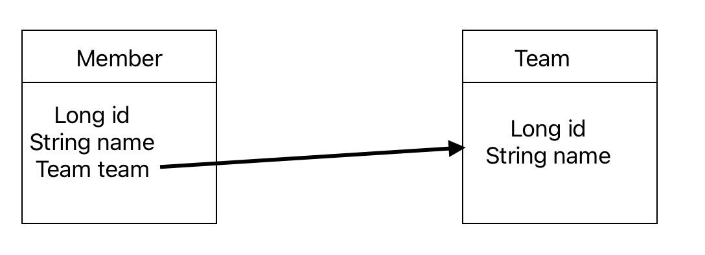
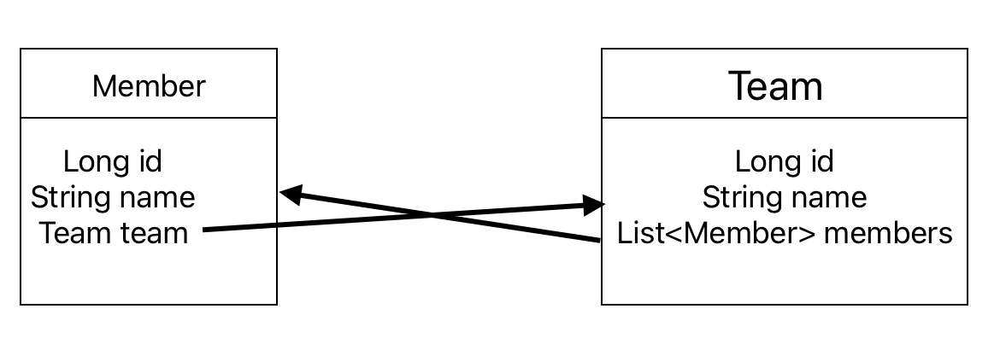
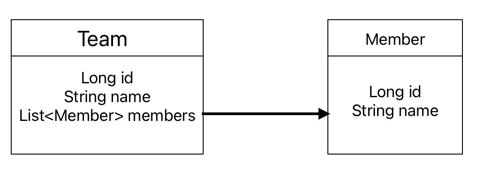
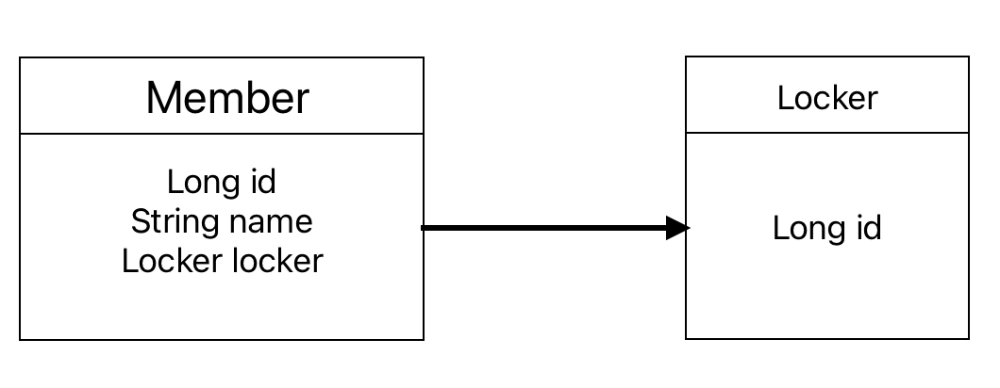
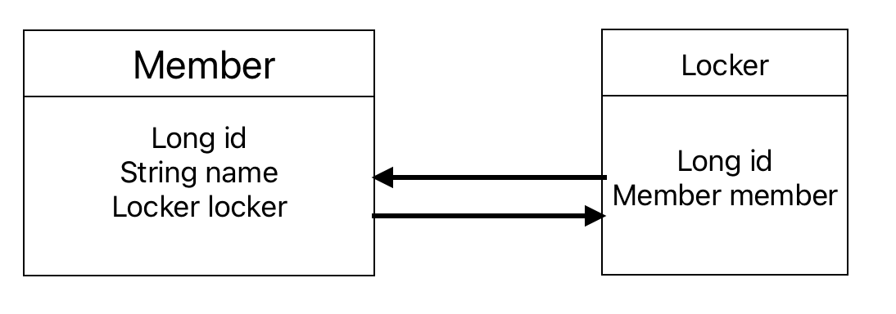
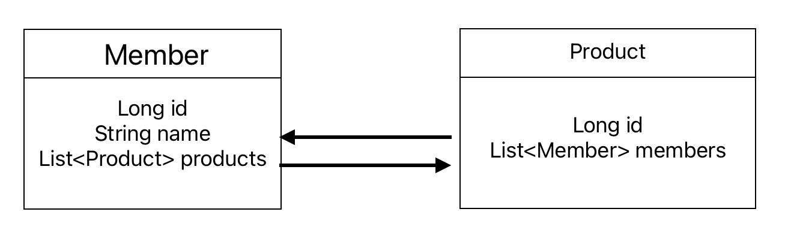
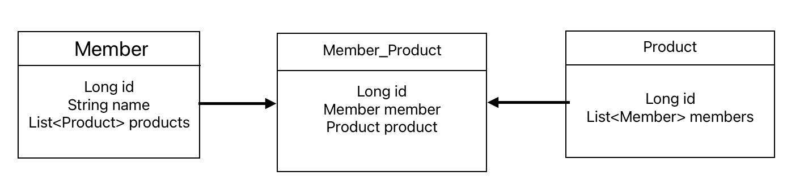

## 연관관계의 방향
연관관계는 방향이 있다. 연관 상대 객체를 참조하고 있는 쪽에서 상대 객체 쪽으로 방향이 흘러간다.

### 단방향 매핑
단방향 매핑은 연관관계 사이의 참조가 하나만 존재하는 매핑을 말한다.



그림을 보면 `Member`와 `Team`은 다대일 연관관계를 가지고 있다. `Member`는 `Team`을 참조하고 있지만, `Team`은 `Member`를 참조하고 있지 않는다. 이 경우를 단방향 매핑이라고 한다.

```java
@Entity
public class Member {
    @Id @GeneratedValue
    private Long id;

    private String name;
    
    @ManyToOne
    @JoinColumn(name = "team_id")
    private Team team;
}

@Entity
public class Team {
    @Id @GeneratedValue
    private Long id;

    private String name;
}
```

### 양방향 매핑
단방향 매핑을 보고 이미 감을 잡았을 지도 모른다.
양방향 매핑은 연관관계가 있는 엔티티가 서로를 참조하고 있는 매핑을 말한다.


`Member`는 여전히 `Team`을 참조하고 있다. 이번에는 `Team`도 `Member`를 참조하고 있다. 이 때, 다대일 관계이므로 하나의 `Team`은 여러 `Member`를 가진다. 따라서 `Member`는 리스트로 참조된다.

```java
@Entity
public class Member {
    @Id @GeneratedValue
    private Long id;

    private String name;
    
    @ManyToOne
    @JoinColumn(name = "team_id")
    private Team team;
}

@Entity
public class Team {
    @Id @GeneratedValue
    private Long id;

    private String name;

    @OneToMany(mappedBy = "team")
    private List<Member> members = new ArrayList<>();
}
```

여기서 주의할 점은 블로그 내의 다른 포스트(연관관계와 연관관계의 주인) 에서도 얘기했지만 `mappedBy`가 붙어 있는 엔티티는 그 연관관계에서 주인이 될 수 없다. 따라서 위의 예제에서는 `Team`에 있는 `members`에 단순히 `member` 인스턴스를 추가한다고 해서 영속되지 않기 때문에 수정할 수 없다.

## 연관관계 매핑

연관관계에는 일대다, 다대일, 일대일, 다대다가 있다.

보통 A대B 의 경우 A를 연관관계의 주인으로 설정한다. 앞으로의 설명들 또한 A를 연관관계의 주인으로 가정하겠다.

### `@OneToMany` (일대다 관계)
일대다 관계는 위에서 본 `Member`와 `Team`의 반대 관계이다.

#### 단방향 매핑


일대다의 경우 단방향 매핑은 위 그림과 같다. 이 경우는 일반적이지 않다.

이유는 일대다 같은 경우 `다` 쪽이 보통 ForeignKey를 가진다. 따라서 실제 DB에서 FK를 사용하여 연관관계를 조작하는 쪽은 `다`인 `Member`이다. 하지만 이 경우는 연관관계의 주인이 `Team`이다.

`Team`엔티티가 관리하는 FK가 `Member`에 있기 때문에 연관관계 관리를 위해 추가적인 Update sql이 실행되어야 한다. 가급적이면 다대일 양방향을 사용하도록 하자.

#### 양방향 매핑

이런 관계는 공식적으로 지원하지 않는다. 다대일 양방향을 사용하도록 하자.

### `@ManyToOne` (다대일 관계)
다대일 단방향, 양방향 매핑은 서두에서 보여준 `Member`와 `Team`과 완전히 동일하기 때문에 넘아가도록 하겠다.

### `@OneToOne` (일대일 관계)
예를 들면 사람과 사물함의 관계다.
한 명의 사람은 하나의 사물함을 가지고, 하나의 사물함 역시 한 명의 사람에게 사용된다. (일반적이지 않은 예외는 무시한다)

일대일 관계는 그 반대도 일대일 관계이다. 연관관계의 주인과 FK를 선정하는 것이 자유롭기 때문에 여러 방법으로 설계할 수 있다. 

앞으로 설명할 일대일 연관관계에서는 `Member`를 주 테이블로 하는 연관관계로 가정하겠다.

#### 단방향 매핑

일대일 관계의 단방향 매핑은 앞서 말했듯이 연관관계의 주인과 FK가 다를 수 있다.



- FK가 Member에 있는 경우

위 그림을 보면 현재 연관관계의 주인은 `Member`엔티티이다. 이 경우는 연관관계의 주인과 FK의 위치가 동일하기 때문에 JPA를 사용하는 개발자로써 수월하게 개발할 수 있다.

- FK가 Locker에 있는 경우

현재 연관관계의 주인은 `Member`이지만 실제 DB의 FK는 `Locker` 테이블에 있을 수도 있다.
이 경우는 JPA에서 지원하지 않는다. 왜냐하면 FK를 관리하는 것이 연관관계의 주인이어야 하는데 DB와 JPA가 완전 어긋나 버리기 때문에 어쩔 도리가 없다.

#### 양방향 매핑

일대일 연관관계에서 양방향 매핑을 하는 경우 간단하다.
테이블에서 FK가 있는 쪽이 연관관계의 주인이다. 그것만 신경써주면 된다. 물론 일대일이라지만 연관관계의 주인 반대쪽은 `mappedBy`를 해줘야 한다.

### `@ManyToMany` (다대다 관계)

다대다 관계는 실제 DB에서 존재할 수 없는 연관관계이다. 따라서 중간테이블이 필요하다.


DB 엔티티 모델이 아니기 떄문에 설명을 하자면, `Member`와 `Member_Product`가 다대일, `Product`와 `Member_Product`가 다대일로 매핑되는 중간 테이블이 생긴 것이다.

실제로 JPA에서 `@ManyToMany`를 사용하여 두 엔티티를 매핑하면 JPA에서 중간 테이블을 만들어 준다. 이 경우 생성된 중간 테이블은 FK인 member와 product 이외에 추가정보는 가질 수 없다. 실무에서는 웬만하면 테이블에 데이터 등록 시간, 수정 시간, 등록자 등의 필드가 정의되어 있기 때문에 이렇게 사용하면 안된다.

`@ManyToMany`를 사용하기 보다는 중간 테이블을 엔티티로 승격시켜서 `@ManyToOne` 두 개로 직접 나눠주자.

## 정리
JPA 연관관계에는 일대일, 일대다, 다대일, 다대다가 있고 각각은 단방향, 양방향 매핑이 가능하다.(다 가능한 것은 아님)

어떤 상황에 어떤 연관관계를 지어줘야 하는 지는 사실 JPA의 문제가 아니라 DB를 더 공부해야 한다. JPA는 마법이 아니다. 관계형 데이터베이스를 객체 지향 개발자가 효율적으로 사용할 수 있도록 도와주는 매핑 기술이기 떄문에 무엇보다 DB에 대한 이해와 학습이 우선이다.

중간중간 세세하게 누락된 부분이 있긴 하지만 이런 연관관계들이 있다는 것을 인지하는 데에 초점을 맞췄다. DB ERD를 직접 그리면 JPA 연관관계가 DB까지 퍼질 것 같아 자제했다.