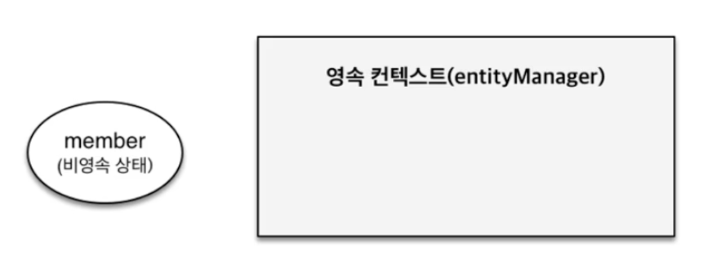
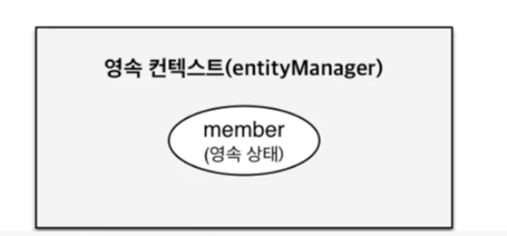
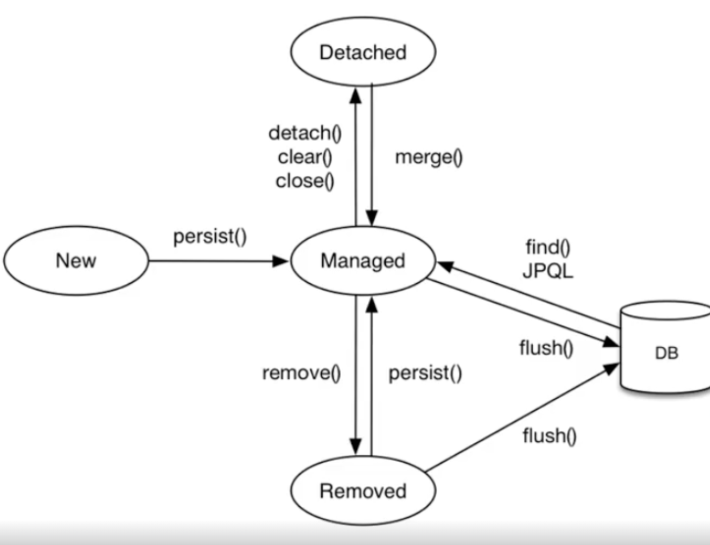
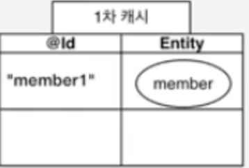

## 영속성 컨텍스트란?
영속성 컨텍스트(Persistence Context)는 엔티티를 영구 저장(영속)하는 환경을 의미한다. 이는 실제로 존재하는 것이 아닌 논리적인 환경이다. 개발자는 영속성 컨텍스트에 엔티티 매니저(EntityManager)를 통해 접근하고, 사용한다.

사실 영속성 컨텍스트 := 엔티티매니저 이다.
스프링에서 엔티티 매니저를 주입 받을 때의 코드를 보면 다음과 같다.

```java
@PersistenceContext
private EntityManager em;
```
엔티티매니저를 영속성컨텍스트라는 애노테이션으로 받아온다. 즉 논리적인 환경을 물리적으로 사용할 수 있도록 도와주는 것이 엔티티매니저이다.

## 상태

영속성 컨텍스트는 영속(managed), 준영속(detached), 비영속(new/transient), 삭제(removed) 상태가 있다.

### 비영속
비영속 상태는 엔티티가 아직 영속성 컨텍스트와 아무 관련이 없는 상태이다.


이 경우, 당연히 엔티티 매니저를 통해 엔티티를 변경하거나, DB에 저장하는 등의 행위는 하지 못한다.

### 영속

영속 상태는 영속성 컨텍스트가 엔티티를 관리하고 있는 상태이다. DB 조회없이 해당 엔티티를 조회하거나, 수정할 수 있다.

### 준영속
엔티티가 영속되었다가 해제된 상태이다.
`detach()`를 통해 분리되거나, `clear()`를 통해 엔티티매니저가 비워진 경우, `close()`를 통해 영속성 컨텍스트가 닫힌 경우 준영속 상태가 된다. 참고로 `merge()`를 하는 경우 다시 영속상태가 된다.

### 삭제
말 그대로 엔티티가 삭제된 상태이다.

### 엔티티 생명주기

엔티티의 생명주기는 위와 같다.

## 특징
영속성 컨텍스트는 트랜잭션과 함께 동작한다. JPA를 사용하여 개발하기 위해서는 무조건 트랜잭션도 사용해야 한다. 왜냐하면 영속성 컨텍스트는 트랜잭션이 시작할 때 실행되고, 끝날 때 같이 끝난다.


영속성 컨텍스트는 크게 다음의 5가지 특징이 있다.

### 1. 1차 캐시
영속성 컨텍스트는 엔티티를 1차 캐시로 가지고 있다.
 

1차 캐시는 key, value 형태로 관리되고 있다.
JPA에서 엔티티를 생성할 때, `@Id`를 무조건 지정해주어야 하는데 이 때의 `@Id` 값이 1차캐시의 key가 되고 해당 엔티티가 value가 된다. 따라서 1차캐시에 보관되기 위해서는 식별가능한 Id가 꼭 있어야한다.

이렇게 1차 캐시로 저장되는 경우는 엔티티가 영속상태인 경우이다.
예를 들어 엔티티를 영속(`em.persist()`, `em.merge()`) 했을 경우, 엔티티를 DB로 부터 조회한 경우 이렇게 1차캐시에 보관된다.

1차 캐시에 보관되고 있는 엔티티를 조회하면 DB가 아니라 1차 캐시에서 가져온다.

### 2. 쓰기 지연

영속성 컨텍스트는 **쓰기 지연 SQL 저장소**가 있다. `em.persist()`로 새로운 엔티티를 Insert 하거나, 수정, 삭제 작업을 할 때 영속성 컨텍스트는 곧바로 해당 작업을 수행하지 않고 SQL문만 만들어서 쓰기 지연 SQL 저장소에 저장해둔다.

이후 `flush`가 발생할 때 혹은 트랜잭션이 종료될 때 모아둔 SQL이 모두 실행된다. 따라서 SQL이 실제로 실행되기 전까지 수정과 삭제 작업은 쿼리 없이도 자유롭게 수행할 수 있다.

> `flush`는 강제 호출(`em.flush()`), JPQL 쿼리 수행, 트랜잭션 커밋 시 수행된다. flush를 한다고 1차 캐시가 지워지지는 않는 점 주의해야 한다. 트랜잭션이 커밋되는 것도 아니다.

### 3. 지연 로딩(Lazy Loading)
영속성 컨텍스트를 통해 엔티티를 조회하는 경우, 지연 로딩을 사용할 수 있다. 지연 로딩이란 엔티티 A의 연관관계에 있는 엔티티 B를 실제로 가지고 오지 않고, B의 필드에 접근할 때 B의 조회쿼리를 날려 로딩하는 것이다.

JPA는 이를 프록시 기술로 구현하였다. 

```java
// Member N : 1 Team

Member findMember = em.find(Member.class, memberId); // findMember의 Team은 실제 객체가 아닌 프록시 객체가 담겨있다.

Team team = findMember.getTeam(); // 아직 프록시 객체
team.getName(); // 프록시의 target에 실제 Team을 매핑한다.


```
target에 실제 객체를 주입한다는 것의 의미를 모른다면, 프록시를 사용하여 실제 객체에 접근하는 것은 AOP, 트랜잭션 등과 유사하므로 프록시 자체에 대해 공부해보길 추천한다.

모든 연관관계에 지연 로딩을 사용하는 것을 권장하지만, 지연로딩을 사용하면 N+1 문제에 직면한다. 페치 조인 등을 활용하여 N+1 문제를 해결해야 한다.

### 4. 변경 감지(Dirty checking)

영속성 컨텍스트에 영속된 엔티티를 수정할 때, 변경 감지라는 것이 작동된다.
1차 캐시에 저장된 엔티티를 가져와서 수정하는 경우, 수정 전 엔티티의 상태를 스냅샷을 찍어놓고 커밋할 때 스냅샷과 현재 상태가 변경되었다면 변경을 감지하고 SQL을 만들어서 수행한다. 따라서 `em.update()` 같은 메서드는 존재하지 않는다. 엔티티 자체를 수정하면 알아서 업데이트를 해준다.

### 5. 동일성(Identity) 보장

영속된 엔티티를 가져오면 그 엔티티는 동일성(Identity)이 보장된다. 이 특징은 JPA가 꽤나 신경쓰는 특징이다. 만약 지연로딩으로 프록시가 영속되더라도, 실제 호출될 때 실제 객체로 변경되는 것이 아니라 프록시의 target만 실제 객체를 바라보게 한다. 즉, 로딩 전과 후 모두 동일한 프록시 객체를 사용하면서 동일성을 보장한다.

## 정리
영속성 컨텍스트는 엔티티를 영속하는 논리적인 환경이다. JPA를 효과적으로 사용하기 위해서는 이 논리적인 환경이 어떻게 작동하는 지 알고 사용하는 것이 중요하다. 우리는 보통 Spring Data JPA 라는 좋은 프레임워크가 있기때문에 이 부분을 간과하는 경우가 있는데 Spring Data JPA보다는 JPA 그 자체, JPA 보다는 DB 그 자체가 더 우선순위이고 중요하다는 것을 되새기자.