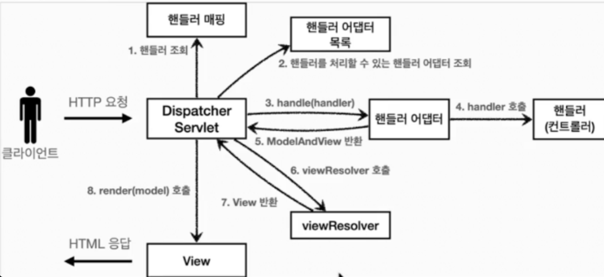

## 웹 서버와 WAS
웹 서버는 클라이언트의 요청에 따라 정적인 리소스를 제공해준다. 정적 리소스라 함은, HTML, CSS, JS 또는 나머지 Asset 파일들을 말한다. 우리는 어느 웹 페이지를 가도 정적인(static) 화면을 보기 힘들다. 

그런데 우리가 사용하는 웹 페이지를 가보면, 버튼을 클릭하여 로그인 하고 검색을 하고 물건을 사는 등 웹과 상호작용을 한다. 이런 일은 웹 서버가 할 수 없는 일이다.

> 물론 HTML, CSS, JS만으로도 웹을 움직일 순 있지만 내가 말하는 것은 좀 더 비즈니스 적인 것이다. 내 아이디와 비밀번호로 로그인을 한다거나 상품을 구매하는 등 말이다.

우리가 회원가입을 하고 사고 싶은 걸 사기 위해서는 뭔가 DB에 접근해야할 필요가 있다. 이 부분을 WAS(Web Application Server)가 해준다. 
WAS는 정적 리소스와 비즈니스 로직을 모두 수행할 수 있다. 따라서 웹 서버가 없더라도 정상적으로 작동한다. 하지만 이 경우 WAS에 너무 많은 책임, 과부하가 있기 때문에 보통 웹 서버와 WAS, DB를 동시에 사용한다.

웹 서버에서는 HTML, CSS, JS 같은 정적 리소스를 반환해주고, WAS는 DB와 통신하여 비즈니스 로직을 수행해준다.

## WAS와 서블릿
스프링 프레임워크를 사용하면 톰캣 이라는 것을 들어봤을 것이다. 


이 톰캣이 바로 WAS이다. 즉, 이 친구가 우리가 DB와 상호작용을 하고 동적인 웹 서비스를 구현하도록 도와준다.

톰캣은 클라이언트의 HTTP 요청이 들어오면 해당 HTTP 요청을 기반으로 `request` 객체를 만들고, 응답을 해주기 위해 `response` 객체를 만든다.

톰캣은 서블릿(Servlet)이라는 객체를 관리하는데, 서블릿에 `request`와 `response` 객체를 각각 `HttpServletRequest`와 `HttpServletResponse`로 전달한다.
그리고 이러한 서블릿을 관리하는 WAS를 서블릿 컨테이너라고 한다.

그런데 만약 서블릿이 하나가 아니라 두 개라면 어떨까?
그냥 아무 서블릿에 다 매핑해주면 될까?

그건 아니다. 서블릿은 특정 URL 패턴에 해당하는 HTTP 요청과 매핑된다.
만약 `http://localhost:8080/hello` 라는 요청이 들어왔을 때는 다음 서블릿이 호출될 것이다.
```java
@WebServlet(name = "helloServlet", urlPatterns = "/hello")
public class HelloServlet extends HttpServlet {

    // 서블릿이 호출되면 service 메서드가 실행됨
    @Override
    protected void service(HttpServletRequest request, HttpServletResponse response) throws ServletException, IOException {
          // 호출됨
    }
}
```

그런데 서블릿 객체를 클라이언트가 HTTP 요청을 할 때마다 생성하는 것은 비효율적이다. 따라서 서블릿은 싱글톤 객체이다. 스프링을 공부한 사람들은 너무나 친숙한 패턴일 것이다. 

싱글톤 객체는 애플리케이션의 런타임에 단 하나의 인스턴스만을 가진다. 즉, 위의 `HelloServlet`은 WAS가 실행될 때 생성되고 종료될 때 함께 종료된다.

## 디스패처 서블릿
URL 패턴마다 서블릿을 구현해주는 것도 비효율적일 것이다.
굳이 입구를 여러 개 열어서 관리하기 힘들 게 할 필요가 있을까...? 서블릿 컨테이너에서 서블릿의 생명주기를 관리해야하는데 서블릿 컨테이너와 명을 같이 하는 서블릿이 불필요하게 여러 개가 생성되어있다면 메모리 적으로도 손해일 것이다.

따라서 스프링 MVC는 다음와 같은 방법으로 클라이언트의 요청을 관리한다.


(사진 참조: 김영한의 스프링 MVC 1편)

갑자기 너무 급발진했는데, 천천히 알아보자.
여기서 `DispathcerServlet`만 서블릿이다. 즉, 클라이언트가 서버로 들어올 수 있는 문을 하나로 좁힌 것이다. 클라이언트의 요청이 들어오면, `DispathcerServlet`는 요청 URL과 매핑되는 핸들러(컨트롤러)를 조회한다. 그리고 그 핸들러를 처리할 수 있는 어댑터를 조회 한다.

만약 핸들러 어댑터가 없다면, 모든 핸들러를 추상화하거나 상속받게끔 해야하는데 각 핸들러는 비즈니스 로직이 많이 다를 것이므로 너무 무거워 진다. 따라서 특정 핸들러를 처리할 수 있는 핸들러 어댑터를 찾아서 핸들러의 처리를 위임한다. 그렇게 처리된 핸들러는 `ModelAndView`를 반환하고 거기에 담긴 view의 논리명으로 `ViewResolver`를 통해 실제 view를 찾은 후, 화면에 렌더링한다.

갑자기 어려운 것을 막 뱉어서 이해하기 어려운 것 송구스럽다. 이 상세한 프로세스를 다루기는 너무 분량이 길다보니 생략하려고 한다.

어쨌든, 중요한 것은 모든 클라이언트의 요청은 WAS를 통해 HTTP 요청 내용이 담긴 `HttpServletRequest`와 `HttpServletResponse`가 만들어지고 디스패처 서블릿을 호출한다. 그리고 해당 요청을 수행할 수 있는 핸들러를 매핑하는데, 이 핸들러가 우리가 흔히 사용하는 컨트롤러 이다. 그리고 컨트롤러는 ModelAndView를 반환하지 않고 다양한 방법으로 응답할 수 있다. 자세한 사항은 아래의 스프링 공식문서를 참고하길 바란다.

- 핸들러(Controller)에 매개변수로 들어갈 수 있는 목록
  
  [Method Arguments :: Spring Framework](https://docs.spring.io/spring-framework/reference/web/webmvc/mvc-controller/ann-methods/arguments.html)

- 핸들러(Controller)에서 응답할 수 있는 목록

  [Retuen Values :: Spring Framework](https://docs.spring.io/spring-framework/reference/web/webmvc/mvc-controller/ann-methods/return-types.html)


## 정리
매우 간단하게 웹 서버, WAS, 서블릿, 스프링 MVC 구조에 대해 살펴보았다. 스프링 MVC가 분량이 매우 방대하고 깊이가 있어서 내 수준에서 그 깊이를 글로 담는 것은 어려웠다. 이 글을 보고 좀 더 깊이있게 알고 싶다면 강의나 스프링 공식문서를 추천한다. 스프링 공식문서가 다른 문서들에 비해 매우 친절하고 잘 알려주는 것 같다.