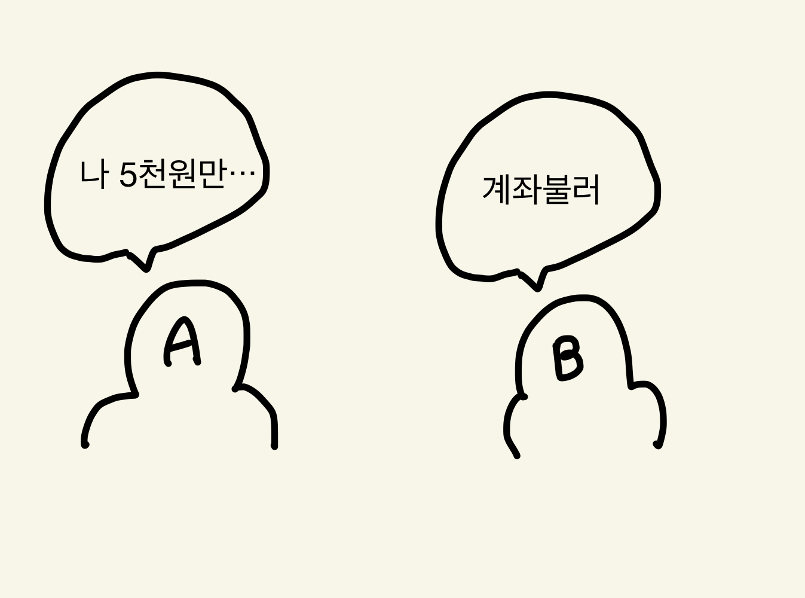
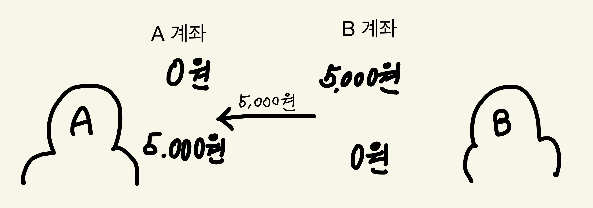
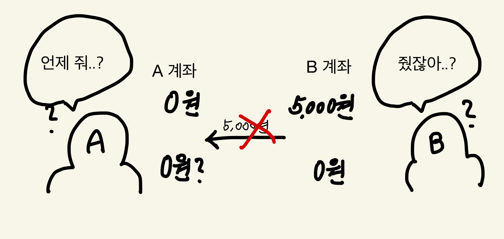
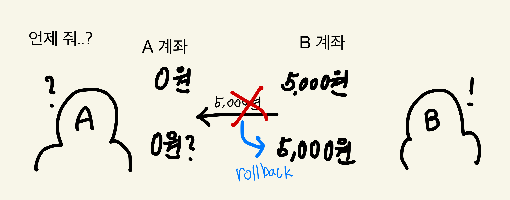
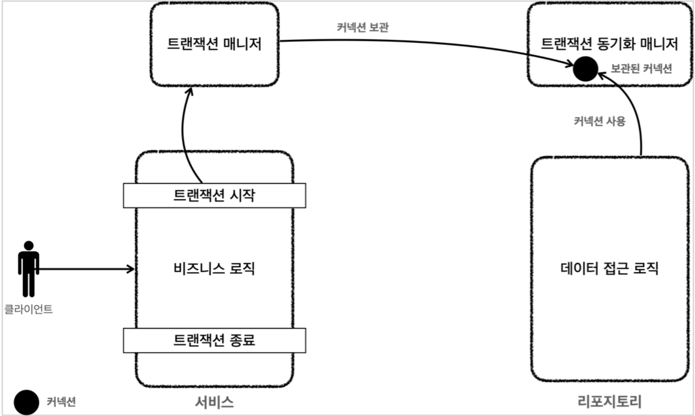

애플리케이션에서 어떤 데이터를 저장하는 방법은 여러가지가 있다. 파일로 저장할 수도 있고, 서버 메모리나 브라우저에 저장하여 사용할 수도 있다.
하지만 우리가 알 듯 대부분의 웹 애플리케이션은 데이터베이스를 사용한다. 왜 데이터베이스를 사용할까?

데이터베이스를 사용하는 이유는 많을 것이다. 조회와 수정이 정교하기도 하고, 보안과 속도 측면에서도 더 좋을수도 있다. 하지만 이것만큼 중요한 이유는 없을 것이다.
바로 ***트랜잭션(Transaction)*** 이다.

## 트랜잭션이란?
트랜잭션은 영어로 거래, 처리 등을 의미한다. DB에서 거래란 무엇일까? 애플리케이션이 데이터를 조회하고, 수정하고, 삭제하고 하는 행위 모두를 하나의 거래라고 말할 수 있을 것이다.

즉, DB를 통해 조회, 수정, 삭제 등을 하는 하나의 단위를 트랜잭션이라고 할 수 있다.

### 트랜잭션이 중요한 이유
만약 트랜잭션이 없다면 어떻게 될까?
조금 흔한 예시지만 그만큼 가장 확실한 예시 하나를 통해 알아보자.

은행 거래의 상황을 가정해보자.
고객 A와 B는 간단한 은행 거래를 하려고 한다.



B가 A에게 5,000원을 계좌이체해 줄 예정이다. 일반적인 상황이라면 다음과 같은 일이 발생해야 한다.



그런데 이런! 은행의 내부 문제로 5,000원을 보내주는 행위가 오류가 나버렸다!



분명 B 입장에서는 돈을 보내줬기 때문에 5,000원이 계좌에서 빠져나갔는데, A는 받지 못했다. 서로 오해가 쌓여 싸우기 직전이다.

이런 경우를 방지하는 것이 바로 ***트랜잭션***이다!

트랜잭션이 적용되어 있었다면 B계좌에서 A계좌로 돈이 이동할 때 에러가 발생한다 하더라도 5,000원이 공중으로 증발하지 않았을 것이다.



이제 그림 놀이는 그만하고 진지한 얘기를 해보겠다.

### 트랜잭션의 특성
트랜잭션은 위의 상황을 방지하는 4가지 특성이 있다. **ACID** 라고 불리는 이 특성을 알아보자.

- 원자성(**A**tomicity): 트랜잭션이 수행되다가 관련 작업이 부분적으로 중단되거나 실패하지 않도록 보장하는 특성이다. 즉, 위의 은행 거래 예제와 같이 부분적인 실패가 아니라 전체 중단, 실패가 됨으로써 해당 트랜잭션이 하나로 움직이는 원자가 된다는 뜻이다.

- 일관성, 정합성(**C**onsistency): 트랜잭션 전 후에 데이터는 모순이 있으면 안된다. 데이터가 정합되어야 하고, 무결성 제약 조건등의 원칙을 위배해서는 안된다.

- 격리성 (**I**solation): 어떤 트랜잭션이 수행되고 있을 때, 다른 트랜잭션이 끼어들지 못하도록 보장하는 특성이다. 트랜잭션 외부에서는 해당 트랜잭션의 내부 단계, 데이터를 볼 수 없다.

- 지속성 (**D**urability): 성공적으로 수행한 트랜잭션은 영원히 반영되어야 함을 의미한다. 시스템 장애가 발생하거나, 여타 문제가 발생하더라도 DB 로그 등으로 해당 트랜잭션의 결과는 저장되어야하고 장애 발생 전으로 돌아갈 수 있어야 한다.

(참조 : https://ko.wikipedia.org/wiki/ACID)

## 스프링과 트랜잭션
스프링은 DB와 연결될 때 하나의 커넥션과 하나의 세션을 1:1로 매핑함으로써 서로 연결된다.
(커넥션-세션을 하나만 가질 수 있다는 것은 아니다.)

각 세션 역시 한 번에 하나의 트랜잭션을 수행할 수 있다.
> 참고) 트랜잭션 전파 옵션 중 `REQUIRES_NEW `에서 트랜잭션 내부에 또 트랜잭션을 생성한다. 하지만 실제로 외부 트랜잭션을 보류하고 내부 트랜잭션을 수행하므로 여러 트랜잭션을 동시에 수행하는 것은 아니다.

기본적으로 SQL에서 트랜잭션을 사용하려면 `SET AUTOCOMMIT = FALSE;`를 해주어야 한다. autocommit이라는 것은 명령어 하나를 실행할 때마다 자동으로 커밋을 한다는 것인데, 이 경우 은행 사례처럼 B가 돈을 보내자마자 자동으로 커밋하기 때문에 중간에 에러가 발생하면 돌려받을 수 없다.

때문에 `autocommit`을 `false`로 설정해주는 것을 트랜잭션이 시작하는 것이라고 보면된다.

### JDBC를 사용한 트랜잭션
JDBC의 `Connection`은 `setAutoCommit()` 메서드를 가지고 있다.

```java
public void save(Member member) throws SQLException {

        Connection conn = null;
        PreparedStatement pstmt = null;

        try {
            conn = ConnectionUtil.getConnection();
            /* 트랜잭션 시작 */
            conn.setAutoCommit(false);
            
            /* 비즈니스 로직 */
            
            /* 트랜잭션 커밋 */
            conn.commit();
        } catch (SQLException e) {
            /* 트랜잭션 롤백 */
            conn.rollback();
            throw new RuntimeException(e);
        } finally {
            /* 자원 해제*/
            close(conn, pstmt, null);
        }
    }
```
트랜잭션 관련 코드만 작성하고 나머지 코드는 제외했다. JDBC의 `Connection`의 `setAutoCommit(false)`를 통해 트랜잭션을 시작하고, 비즈니스 로직을 모두 수행한 다음 `conn.commit()`으로 커밋한다. 만약 예외가 발생하면 `conn.rollback()`으로 `setAutoCommit(false)`와 `conn.commit()` 사이의 모든 DB 접근 로직을 롤백하여 초기화한다.

### 트랜잭션 매니저
스프링에서는 트랜잭션 매니저(Transaction Manager)를 제공한다.
이 트랜잭션 매니저는 JDBC에 직접 의존하는 것이 아니기 때문에 JDBC을 추상화하여 다른 데이터 접근 기술로 변경하더라도 클라이언트 코드를 유지할 수 있다.

트랜잭션 매니저는 생성자 파라미터로 데이터소스를 받는다. 그 말은 즉 트랜잭션 매니저에서 커넥션을 생성(혹은 커넥션풀로 부터 빌림)할 수 있다는 것이다.

```java
PlatformTransactionManager txManager = new DataSourceTransactionManager(new HikariDataSource());
        TransactionStatus status = txManager.getTransaction(new DefaultTransactionDefinition());
```
> TransactionManger를 사용하려면 `TransactionManger를`가 아니라 `PlatformTransactionManager`를 사용해야 한다.

트랜잭면 매니저에서 `getTransaction()`을 하게 되면 `TransactionStatus`를 가져오는데, 이 status로 트랜잭션을 커밋하거나 롤백할 수 있다. 이 status가 트랜잭션의 원자성을 보증해준다고 할 수 있다. 동일한 트랜잭션이라면 동일한 status로 작업해야 한다.

```java
    try {
        // 비즈니스 코드
         txManager.commit(status);
    } catch (Exception e) {
        txManager.rollback(status);
        throw e;  
    }
```

status를 사용하면 트랜잭션의 원자성이 보장된다고 했는데 왜 그런걸까?
그 이유를 알기 위해서는 내부 동작흐름을 이해할 필요가 있다.

참조: 스프링 DB접근 1편 (인프런 김영한)

트랜잭션 매니저를 사용하는 경우 트랜잭션 매니저에서 `getTransaction()`을 하는 순간 커넥션이 생성되며 트랜잭션이 시작된다.
```java
  TransactionStatus status = txManager.getTransaction(new DefaultTransactionDefinition());
```
생성된 커넥션은 트랜잭션 동기화 매니저에 보관된다. 트랜잭션 동기화 매니저는 해당 커넥션을 쓰레드로컬로 저장하여 멀티쓰레드에 안전한 트랜잭션을 보장해준다.

리포지토리의 메서드에서는 
```java
DataSourceUtils.getConnection();
```
를 사용하여 커넥션을 가져오면, 트랜잭션 동기화 매니저에서 동기화 중인 커넥션을 가져올 수 있다.

커밋 하거나 롤백하는 트랜잭션 종료 시에도 트랜잭션 매니저가 종료하고 커넥션을 반납 혹은 종료해준다.


## 정리
오늘은 트랜잭션의 정의와 특성, 스프링에서의 트랜잭션 기본에 대해 간단하게 알아보았다. 사실 스프링은 AOP라는 기술이 있고, 이 AOP를 적용하면 트랜잭션 관련 코드가 정말 깔끔해진다. 딱히 트랜잭션 매니저나 트랜잭션 동기화 매니저, 커넥션을 신경쓰지 않아도 될 것이다.

하지만 더 효율적으로 사용하는만큼 실제 동작 원리를 모른다면 그 효율성이 떨어질 것이다. 문제가 발생했을 때, 스프링 트랜잭션 AOP만 의존한다면 본질적인 문제를 찾는 것은 어려울 것이다.

다음 포스트에는 트랜잭션 AOP와 트랜잭션 전파에 대해 포스팅하겠다.