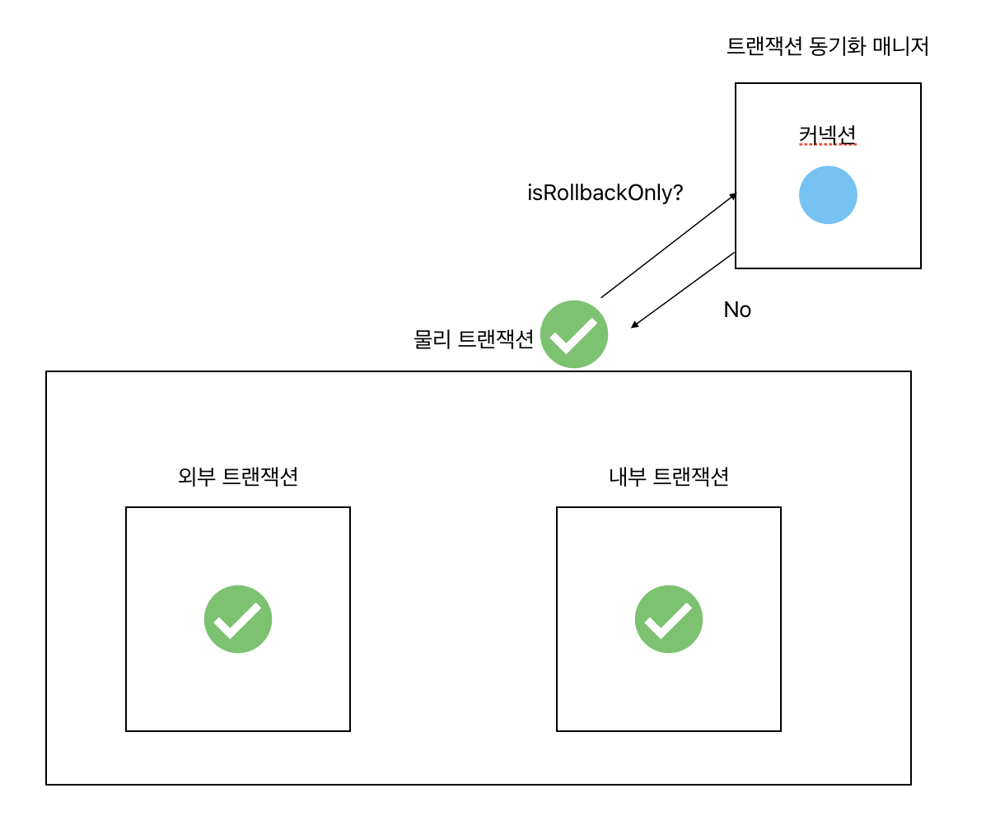
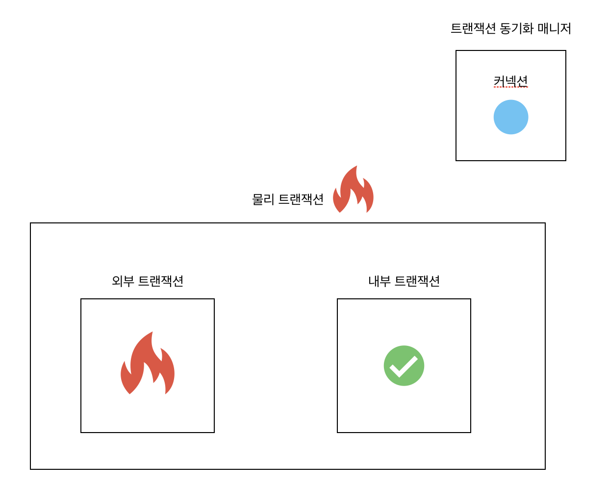
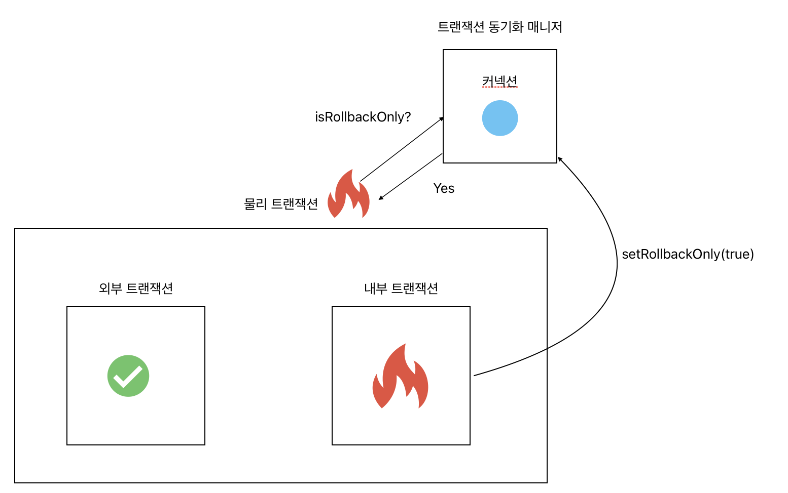

## 명령형, 선언형 트랜잭션
선수지식으로 간단히 설명하자면 스프링 프레임워크는 **선언형 트랜잭션**과 **명령형 트랜잭션**으로 나뉘어 트랜잭션 관리를 제공한다. 선언형 트랜잭션은 `@Transactional`과 같이 트랜잭션을 사용하겠다 라고 선언하는 것이고, 명령형 트랜잭션은 직접 `TransactionManager` 등을 통해 코드로 트랜잭션을 구현하는 것이다.

## 물리적, 논리적 트랜잭션
이번에는 물리 트랜잭션과 논리 트랜잭션에 대해 설명하겠다. 뭐 이렇게 트랜잭션 종류가 많나 하지만 각각이 상이한 것은 아니고 OOP와 AOP같이 갱생하는? 관계이다.

### 물리 트랜잭션(Physical Transaction)
실제 데이터베이스 커넥션에 사용되는 트랜잭션이다. 즉, 물리 트랜잭션을 커밋하면 실제 DB에 커밋되고 롤백하면 실제 DB가 롤백된다.

### 논리 트랜잭션(Logical Transaction)
코드 상 존재하는 트랜잭션이다. 실제 DB의 트랜잭션이 아니며, 논리 트랜잭션이 커밋되거나 롤백된다고 해서 무조건 DB에 반영되지는 않는다.

### 구분하는 이유
만약 트랜잭션이 이미 수행 중인데, 내부에서 새로운 트랜잭션이 시작되면 어떻게 될까? 

이미 수행 중인 외부 트랜잭션과 내부 트랜잭션 모두 물리 트랜잭션이 되어 각각 DB에 커밋 롤백을 책임질 것인가? 아니면 내부 트랜잭션이 롤백되면 모두 롤백될 것인가? 

뭔가 정책이 필요해보인다.

그 정책이 바로 오늘의 주제인 **트랜잭션 전파**이다.

## 트랜잭션 전파
글의 서두에서 명령형 트랜잭션과 선언형 트랜잭션에 대해 설명했다. 

명령형 트랜잭션은 말한대로 개발자가 프로그래밍해서 트랜잭션을 구현하는 것이다. 즉, 트랜잭션 내부의 트랜잭션을 롤백을 하든 커밋을 하든 개발자가 마음대로 구현하면 된다.

하지만 선언형 트랜잭션은 다르다.
`@Transactional` 이라는 애노테이션이 알아서 다 해주기 때문에 개발자가 간섭하는 데에는 한계가 있다. 따라서 **트랜잭션 전파** 라는 옵션을 통해 외부, 내부 트랜잭션의 커밋 롤백 기준을 선언해줄 수 있다.

> 트랜잭션 전파(Transaction Propagation)는 스프링에서 이미 트랜잭션이 진행 중일 때, 새로운 트랜잭션이 추가되면 트랜잭션 관리를 어떻게 할 것인지 결정하는 속성이다.

### REQUIRED - default
트랜잭션 전파의 기본값은 `REQUIRED`이다. `@Transactional`만 붙여주면 해당 속성이 지정된다.

전파 옵션이 `REQUIRED`인 경우 이것만 기억하면 된다.
> 모든 논리 트랜잭션이 커밋이어야 실제로 커밋된다. 하나라도 롤백되면 모두 롤백된다.

이것만 알면 개발하는 데 큰 지장은 없지만 어떻게 작동하는 지 알아보자.

1. 모든 논리 트랜잭션이 커밋 - 커밋

> 참고로 외부 트랜잭션과 내부 트랜잭션은 논리 트랜잭션이기도 하다.

전파옵션이 `REQUIRED`인 경우 내부 트랜잭션이 커밋되어도, 실제로는 아무것도 하지 않는다. 외부 트랜잭션은 현재 물리 트랜잭션의 역할을 하는데, 트랜잭션을 커밋할 때 트랜잭션 동기화 매니저에 커넥션이 `isRollbackOnly` 상태인 지 확인한다. `false`이기 때문에 정상적으로 DB에 커밋한다.

2. 내부 트랜잭션 커밋, 외부 트랜잭션 롤백 - 롤백

이 부분도 간단하다.

내부 트랜잭션은 커밋할 때 아무것도 안 한다고 했다. 외부 트랜잭션이 롤백되었기 때문에 그냥 롤백이다.

3. 내부 트랜잭션 롤백, 외부 트랜잭션 커밋 - 롤백

이 부분이 꽤 까다롭다.

내부 트랜잭션이 롤백될 때에는, 실제 물리트랜잭션을 롤백하는 것이 아니라 트랜잭션 동기화 매니저에 setRollbackOnly를 true로 설정해준다. 물리 트랜잭션이 커밋될 때 트랜잭션 동기화 매니저에 isRollbackOnly가 true 인 지 확인하고, true라면 무조건 물리 트랜잭션은 롤백된다.

### REQUIRES_NEW
`REQUIRED`는 둘 중하나라도 롤백이라면 모두 롤백을 하는 등 물리, 논리 트랜잭션 간의 원자성이 유지되었다. 

그런데 만약 내부 트랜잭션도 내부 트랜잭션대로 DB에 커밋 혹은 롤백하고, 외부 트랜잭션은 또 외부트랜잭션 대로 DB에 커밋 혹은 롤백하고 싶다면 어떻게 해야할까?

`REQUIRES_NEW`는 내부 트랜잭션도 물리 트랜잭션으로 지정하는 전파옵션이다.

해당 옵션을 사용하면 

논리 트랜잭션을 커밋할 때, 트랜잭션의 `isNewTransaction()`이 `true` 인 경우 실제 DB에 커밋하고 `false`인 경우 아무것도 하지 않는다. 롤백의 경우 `true`면 실제 롤백, `false`인 경우 `rollbackOnly`를 true로 변경한다.

즉, `isNewTransaction()`이 `true`인 트랜잭션은 실제 DB의 트랜잭션 (물리 트랜잭션)이라는 뜻이다.

갑자기 `isNewTransaction`에 대해 설명한 이유는 `REQUIRES_NEW`와 깊은 관련이 있기 때문이다. `REQURIES_NEW` 옵션을 사용하면 내부 트랜잭션 역시 `isNewTransaction`이 `true`인 상태로 트랜잭션이 시작된다. 이 말은 결국 커밋, 롤백된 것이 내부 트랜잭션이라도 물리 트랜잭션으로써 DB에 적용된다는 것이다.

유의할 점은 실제로 트랜잭션은 한 번에 하나만 수행할 수 있다. `REQUIRES_NEW` 옵션으로 내부 트랜잭션이 물리 트랜잭션이 된 경우, 외부 트랜잭션은 잠시 보류(suspend) 상태가 되고, 내부 물리 트랜잭션이 종료되면 다시 외부 트랜잭션이 수행된다.

---
이 아래에 있는 전파 옵션들은 잘 사용되지 않는다.

### SUPPORT
말 그대로 트랜잭션을 지원해주는 옵션이다.
- 기존 트랜잭션이 있는 경우
: 기존 트랜잭션에 참여
- 기존 트랜잭션이 없는 경우
: 트랜잭션 없이 진행

### NOT_SUPPORT
트랜잭션을 SUPPORT 하지 않는다.
- 기존 트랜잭션이 있는 경우
: 기존 트랜잭션 보류하고 트랜잭션 없이 진행
- 기존 트랜잭션이 없는 경우
: 트랜잭션 없이 진행

### MANDATORY
트랜잭션이 의무사항이다.
- 기존 트랜잭션이 있는 경우
: 기존 트랜잭션 참여
- 기존 트랜잭션이 없는 경우
: `IllegalTransactionStateException` 예외 발생

### NEVER
트랜잭션을 사용하지 않는다는 것이다. MANDATORY의 반대이다.
- 기존 트랜잭션이 있는 경우
: `IllegalTransactionStateException` 예외 발생
- 기존 트랜잭션이 없는 경우
: 트랜잭션 없이 진행

### NESTED
중첩 트랜잭션
- 기존 트랜잭션이 있는 경우
: 중첩 트랜잭션 시작. 중첩 트랜잭션은 외부의 영향은 받지만 외부로 영향을 주지는 않는다.
- 기존 트랜잭션이 없는 경우
: 새로운 트랜잭션을 생성한다.

## 정리
트랜잭션 전파는 스프링의 선언형 트랜잭션에서 필요한 옵션이다. 기본값은 `REQUIRED`이며 주로 이 옵션을 사용한다. 만약 `@Transactional`을 사용하여 개발하는데 데이터가 자꾸 롤백되거나 원치 않은 커밋이 발생한다 하는 경우 트랜잭션 전파에 대해 생각해보자.

## 마치며
오늘은 트랜잭션의 전파에 대해 간단하게 알아보았다. 취준하며 면접다닐 때 트랜잭션 전파에 대해 아냐고 질문받은 적이 있었다. 그 때는 '음.. 그런 것까지 알아야하나?' 라는 어리석은 생각을 했었다. 하지만 트랜잭션은 스프링 백엔드 개발의 필수라고 할 수 있고, 거기에 속한 트랜잭션 전파 역시 필수이다. 
취준 시절 많이 안다고 얼핏 생각했었는데 겸손하지 못했던 것 같다. 기술적 겸손함을 갖춘채로 꾸준히 공부해나가다보면 나의 커리어와 자아실현은 따라올 것이라고 믿는다.