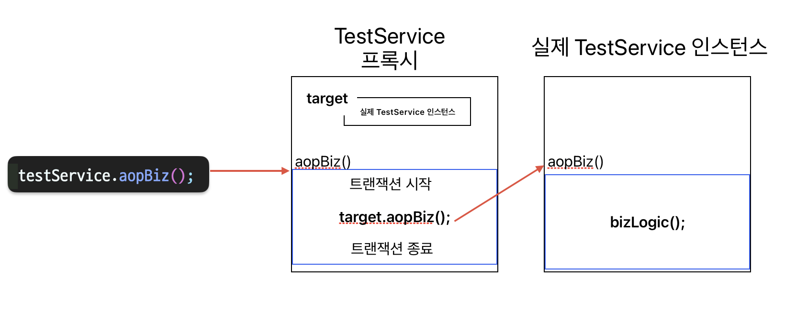

## 트랜잭션 AOP
개발자가 DB를 사용하는데 트랜잭션이 없으면 어플리케이션이 말썽투성이일 것이다. 그 만큼 중요한 것이 트랜잭션이다.
매우 중요하기 때문에 스프링에서는 트랜잭션을 위한 AOP를 미리 만들어두고 개발자에게 제공한다. 개발자는 트랜잭션이 필요한 곳에 `@Transactional`만 붙이고 사용하면 된다.

스프링은 트랜잭션을 AOP로 제공하고 있는데 AOP 자체는 다른 글에서 설명하고, 여기서는 간략하게만 알아보겠다.

### AOP가 아닌 트랜잭션
[트랜잭션의 기본과 스프링 트랜잭션](https://nimoh.tistory.com/21) 포스팅에서도 알아봤 듯이 스프링에서 트랜잭션을 사용하려면 `TransactionManager`를 사용해야한다.

아주 간략하게 코드로 알아보겠다.

```java
/* service */
@RequiredArgsContructor
public class TestService {

    private final Datasource datasource;

    public void txManagerBiz() {
            PlatformTransactionManager txManager = new DataSourceTransactionManager(dataSource);
            TransactionStatus status = txManager.getTransaction(new DefaultTransactionDefinition());;
            try {
                // 비즈니스 로직
                bizLogic(); // <- 겨우 요거 때문에
                txManager.commit(status);
            } catch (Exception e) {
                e.printStackTrace();
                txManager.rollback(status);
            }
    }
}
```

> DataSource는 application.properties 혹은 application.yml 파일에 dataSourec 세팅을 해주면 스프링부트에서 빈으로 등록해준다.

와우! 끝내주게 복잡하다. 겨우 `bizLogic()` 하나 수행하는 건데도 지저분하고 눈에 안들어온다. 필수 로직보다 트랜잭션 관련 로직이 훨씬 많다.

~~위의 방법은 커넥션을 직접 가져와서 `setAutoCommit(true)`해주고, 사용한 뒤 릴리즈해야하는 귀찮은 일을 하지 않아도 되므로 꽤 편리해진 방법이다. 하지만 그렇다 하더라도 실제 중요한 비즈니스 로직보다 트랜잭션 관련 코드가 훨씬많다. 위의 코드에서 핵심 로직은 `bizLogic()` 호출이 전부인데 트랜잭션 관련코드가 서비스 코드를 점령하고 있다.~~

> 스프링에서 service layer는 순수 자바코드를 유지하는 것이 좋다. 유지보수하기에도, 테스트하기에도 좋으며 컨트롤러, 서비스, 레포지토리로 분리한 이유가 서비스 컨트롤러에는 UI 관련, 레포지토리는 DB관련 종속 코드를 두고 서비스 코드는 순수 자바 로직만을 작성하기 위해서 이다.

따라서, 불순한 서비스 코드를 순수하게 변경할 필요가 있다.

### AOP를 적용한 트랜잭션
사용방법은 정말 간단하다. 트랜잭션을 적용하고자 하는 클래스나 메서드 에 `@Transactional` 애노테이션을 붙이면 된다.

위의 불순한 코드를 트랜잭션 AOP로 순수하게 변경해보겠다.

```java
public class TestService {

    @Transactional
    public void aopBiz() {
        bizLogic();
    }

}
```
짠~! 너무 극단적인가? 하지만 이게 맞다. `@Transactional`만 붙여주면 위에서 복잡하게 하던 것들 알아서 다 해준다.
신기하지 않은가?

하지만 이것은 코드를 숨겨주거나 없애주는 마법이 아니다. 비밀은 바로 `AOP`이다.


AOP를 처음 접한다면 이해가 안되는 사진일 수도 있다.
간단하게 말하자면 AOP는 관점지향프로그래밍으로, 스프링에서는 프록시를 통해 AOP를 사용할 수 있다.

만약 `aopBiz()`에 `@Transactional` 이 붙어있다면 `TestService` 클래스의 `aopBiz()`를 호출했을 때, 실제 인스턴스가 아닌 프록시(가짜 객체)를 호출한다.
가짜 객체는 `target`으로 호출한 실제 인스턴스를 가지고 있다. 즉, 프록시 객체가 트랜잭션을 시작하고 우리가 호출한 실제 `testService.aopBiz()`를 실행해준다. 실행이 완료되면 프록시가 트랜잭션을 종료해준다.

#### `@Transactional` 적용범위
`@Transactional`는 타입 혹은 메서드에 적용 수 있다.

- 타입(클래스, 인터페이스)에 적용하면 해당 타입의 모든 public 메서드들에 트랜잭션을 적용한다.

- 메서드에 적용하면 해당 메서드만 트랜잭션을 적용한다.

- 주의할 점은, 메서드 하나만 `@Transactional`을 적용하더라도, 프록시 객체를 생성하고 프록시 객체를 호출하게된다.
- 만약, 타입과 메서드에 모두 적용되어있다면 자세한 것 우선으로 적용한다.
(예, 클래스와 메서드에 모두 적용됐다면 메서드에 적용된 트랜잭션 옵션을 따른다.)

## 정리
트랜잭션 AOP는 매우 편리하고 사용하기도 쉽기때문에 별 생각없이 사용하기 좋다. 하지만 쉬운 디버깅, 알고 쓰는 개발자가 되기 위해 AOP와 프록시에 대해 학습하고, 그 안에서 트랜잭션 매니저와 트랜잭션 동기화 매니저, 데이터소스 등이 어떻게 작동하여 우리가 이 편리함을 얻는 지 그 원리도 알아야할 필요가 있다.

아무것도 모르고 냅다 트랜잭션 필요한 곳에 `@Transactional`만 붙이다 보면 언젠가는 난관에 봉착할 것이다. 예를 들면 AOP의 내부호출 같은 문제 말이다.

오늘은 트랜잭션 AOP에 대해 간단하게 알아보았다. 트랜잭션 전파까지 이번 포스트에 넣으려고 했는데, 트랜잭션 전파 역시 중요한 개념이기 때문에 작성하다보면 너무 길어질 것 같아서 따로 작성하려고 한다.