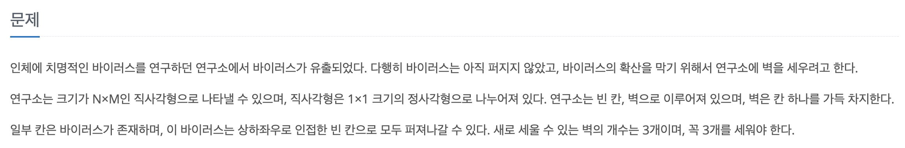
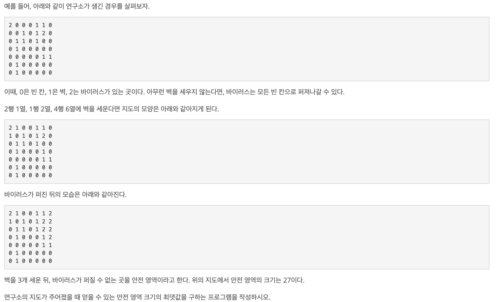

백준: https://www.acmicpc.net/problem/14502

## 문제





## 문제 풀이
정답 비율이 무려 54%가 넘는다. 그런데도 나는 내 힘으로 풀지 못했다.

문제는 해결을 위한 아이디어가 떠오르지 않았다. 바이러스가 없는 모든 '0'을 3개 고르는 경우의 수를 모두 구하려고 생각했었는데 '그렇게 무식할 리가 없지..'라는 생각에 말도 안되는 풀이라고 생각하고 다른 끙끙 앓다가 결국 구글링을 했다...🥲

우선 `3 <= N,M <= 8` 로 매우 연구소의 크기가 매우 작았다. 그 말은 즉슨 엄청난 반복을 저질러도 안전하다는 뜻으로 느껴졌다.

핵심 로직은 이렇다.
1. dfs를 통해 **3개의 벽을 세울 수 있는 모든 경우의 수**를 구한다.
2. 각각의 경우의 수가 세팅되었을 때 BFS를 통해 바이러스를 퍼트려본다.
3. BFS, 즉 바이러스가 모두 퍼진 뒤에 안전영역의 개수를 찾아본다.
4. 안전영역의 최댓값을 출력한다.

```java
public class Boj_14502 {
    private static int row;
    private static int column;
    private static int[][] map;
    private static int[][] copyMap;
    private static List<int[]> virusLocation = new ArrayList<>();
    private static int[] dr = {0, 1, 0, -1};
    private static int[] dc = {1, 0, -1, 0};
    private static int safeAreaCount = Integer.MIN_VALUE;

    public static void main(String[] args) throws IOException {
        BufferedReader br = new BufferedReader(new InputStreamReader(System.in));
        StringTokenizer st = new StringTokenizer(br.readLine());
        row = Integer.parseInt(st.nextToken());
        column = Integer.parseInt(st.nextToken());
        map = new int[row][column];

        for (int i = 0; i < row; i++) {
            st = new StringTokenizer(br.readLine());
            for (int j = 0; j < column; j++) {
                map[i][j] = Integer.parseInt(st.nextToken());
                if (map[i][j] == 2) {
                    virusLocation.add(new int[]{i, j});
                }
            }
        }

        dfs(0);
        System.out.println(safeAreaCount);
    }

    private static void dfs(int wallCount) {
        if (wallCount == 3) {
            safeAreaCount = Math.max(bfs(), safeAreaCount);
        } else {
            for (int i = 0; i < row; i++) {
                for (int j = 0; j < column; j++) {
                    if (map[i][j] == 0) {
                        map[i][j] = 1;
                        dfs(wallCount+1);
                        map[i][j] = 0; // <<< 벽을 3개 세우고, 바이러스를 퍼트린 뒤 다시 허물어야 다음 벽 시나리오를 세팅해볼 수 있다.
                    }
                }
            }
        }
    }

    private static int bfs() {
        boolean[][] visited = new boolean[row][column];
        Queue<int[]> queue = new LinkedList<>();
        for (int[] virus : virusLocation) {
            queue.offer(virus);
        }
        copyMap = new int[row][column];

        for (int i=0; i<map.length; i++) {
            copyMap[i] = map[i].clone();
        }

//        copyMap = map.clone(); << 얕은 복사

        while (!queue.isEmpty()) {
            int[] polled = queue.poll();
            int curRow = polled[0];
            int curCol = polled[1];

            for (int i=0; i<4; i++) {
                int nextRow = curRow + dr[i];
                int nextCol = curCol + dc[i];

                if (nextRow < 0 || nextCol < 0 || nextRow >= row || nextCol >= column) {
                    continue;
                }

                if (!visited[nextRow][nextCol] && copyMap[nextRow][nextCol] == 0) {
                    queue.offer(new int[]{nextRow, nextCol});
                    copyMap[nextRow][nextCol] = 2;
                    visited[nextRow][nextCol] = true;
                }
            }
        }
        return countSafeArea(copyMap);
    }

    private static int countSafeArea(int[][] map) {
        int result = 0;
        for (int i = 0;i < row; i++) {
            for (int j = 0;j < column; j++) {
                if (map[i][j] == 0) {
                    result++;
                }
            }
        }

        return result;
    }
}
```

이 문제의 핵심은 DFS 로직과 연구실의 복사에 있다. BFS는 다른 BFS들과 다를 바 없다.

### 1. DFS에서 중요한 것은 벽을 세운 뒤에 다시 허무는 것이다.

```java
    for (int i = 0; i < row; i++) {
        for (int j = 0; j < column; j++) {
            if (map[i][j] == 0) {
                map[i][j] = 1;
                dfs(wallCount+1);
                map[i][j] = 0;
            }
        }
    }
```
위 코드는 `dfs()` 내부 코드이다. 잘 보면 연구소(map)에 벽을 세웠다(1)가 dfs() 호출이 끝나고 다시 허문다(0). 이유는 벽을 세우고 dfs()를 호출하게 되면 그 벽이 세워진 상태로 다음 벽을 세우러 재귀호출된다. 그렇게 벽의 개수가 3개가 되었을 때, bfs()를 통해 바이러스를 퍼트리고 세 번째 벽부터 첫 번째 벽까지 차례로 `map[i][j] = 0`이 호출된다.

그래야 다음 벽 세팅 시나리오를 제대로 수행할 수 있다.

### 2. 얕은 복사와 깊은 복사
연구소에 바이러스를 퍼트리는 실험(BFS)을 할 때마다 새로운 임시 연구소를 만들어야 한다. 왜냐하면 기존 연구소(`map`)에 바이러스를 다 퍼트려버리면 다음 시나리오를 정상적으로 수행해볼 수가 없다.

임시 연구소를 생성하기 위해서는 복사의 깊이에 대해 알 필요 있다. 자바에는 얕은 복사(Shallow Copy)와 깊은 복사(Deep Copy)가 있다. 아마 대부분의 언어에 있는 개념일 것이다.

#### 얕은 복사
얕은 복사는 필드를 복사하는 것이다. JVM에는 스택과 힙 메모리로 나뉘어 스택에는 필드, 힙에는 인스턴스가 저장되어 필드가 인스턴스의 주소를 가지는 형태로 객체가 생성된다. 이 때, 얕은 복사를 하게되면 스택에 있는 필드만 복제되고 힙에 있는 인스턴스는 복제되지 않는다. 즉 원본과 복사본이 동일한 인스턴스를 참조한다. 따라서 복사본을 수정하면 원본도 수정된다.

#### 깊은 복사
깊은 복사는 필드, 인스턴스와 인스턴스가 참조하는 모든 객체를 재귀적으로 복사한다. 이 경우, 복사본과 원본은 완전히 분리된다.

```java
copyMap = new int[row][column];

for (int i=0; i<map.length; i++) {
    copyMap[i] = map[i].clone(); // 깊은 복사
}

    copyMap = map.clone(); // << 얕은 복사
```

위 코드의 경우 `Object.clone()`을 사용하여 객체를 복사했는데, 이 메서드는 기본적으로 얕은 복사를 수행한다. 그런데 특수하게  원시타입의 배열인 경우에는 깊은 복사를 하도록 구현되어 있다.

#### 결과
얕은 복사로 임시 연구소를 만들었다면 임시 연구소에 바이러스를 퍼트려도 실제 연구소까지 바이러스가 퍼진다.

따라서 `copyMap[i] = map[i].clone(); `의 경우는 원시타입의 배열(ex. {1, 2, 3, 0, 5})을 복사하는 것이다. 하지만 `copyMap = map.clone();` 을 하게 되면 2차원 배열(ex. {{1, 2}, {3, 4}}을 복사하므로 원시타입 배열의 `clone`이 아니라서 얕은 복사를 진행하게 된다.

## 정리
이 문제가 54%의 정답률을 가진 것에 놀랐다. 이보다 낮은 정답률인데도 더 쉬운 문제들도 많았는데 사람들이 이렇게나 잘하나.. 생각이 들었다. 아니면 나처럼 정답을 봤을 수도 있겠다.

DFS 문제, BFS 문제 각각은 많이 풀어봤지만 두 개를 동시에 사용한 적은 처음인 것 같다. 덕분에 그래프 문제에서의 안목이 넓어진 것 같다. 또, 지나치게 제약조건이 관대한 경우 이렇게 시간복잡도가 복잡할 수 있다는 뜻으로 생각해도 좋을 듯하다.

어쩌다보니 `clone()`을 사용하는 얕은 복사와 깊은 복사에 대해 공부해볼 수 있었다. 코딩테스트 공부도 하며 자바 공부도 할 수 있으면 그만한 일석이조가 없는 듯 하다.
