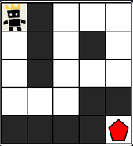

https://school.programmers.co.kr/learn/courses/30/lessons/1844

## 문제

ROR 게임은 두 팀으로 나누어서 진행하며, 상대 팀 진영을 먼저 파괴하면 이기는 게임입니다. 따라서, 각 팀은 상대 팀 진영에 최대한 빨리 도착하는 것이 유리합니다.

지금부터 당신은 한 팀의 팀원이 되어 게임을 진행하려고 합니다. 다음은 5 x 5 크기의 맵에, 당신의 캐릭터가 (행: 1, 열: 1) 위치에 있고, 상대 팀 진영은 (행: 5, 열: 5) 위치에 있는 경우의 예시입니다.


위 그림에서 검은색 부분은 벽으로 막혀있어 갈 수 없는 길이며, 흰색 부분은 갈 수 있는 길입니다. 캐릭터가 움직일 때는 동, 서, 남, 북 방향으로 한 칸씩 이동하며, 게임 맵을 벗어난 길은 갈 수 없습니다.  
아래 예시는 캐릭터가 상대 팀 진영으로 가는 두 가지 방법을 나타내고 있습니다.

- 첫 번째 방법은 11개의 칸을 지나서 상대 팀 진영에 도착했습니다.


- 두 번째 방법은 15개의 칸을 지나서 상대팀 진영에 도착했습니다.


위 예시에서는 첫 번째 방법보다 더 빠르게 상대팀 진영에 도착하는 방법은 없으므로, 이 방법이 상대 팀 진영으로 가는 가장 빠른 방법입니다.

만약, 상대 팀이 자신의 팀 진영 주위에 벽을 세워두었다면 상대 팀 진영에 도착하지 못할 수도 있습니다. 예를 들어, 다음과 같은 경우에 당신의 캐릭터는 상대 팀 진영에 도착할 수 없습니다.



게임 맵의 상태 maps가 매개변수로 주어질 때, 캐릭터가 상대 팀 진영에 도착하기 위해서 지나가야 하는 칸의 개수의 **최솟값**을 return 하도록 solution 함수를 완성해주세요. 단, 상대 팀 진영에 도착할 수 없을 때는 -1을 return 해주세요.

##### 제한사항

- maps는 n x m 크기의 게임 맵의 상태가 들어있는 2차원 배열로, n과 m은 각각 1 이상 100 이하의 자연수입니다.
    - n과 m은 서로 같을 수도, 다를 수도 있지만, n과 m이 모두 1인 경우는 입력으로 주어지지 않습니다.
- maps는 0과 1로만 이루어져 있으며, 0은 벽이 있는 자리, 1은 벽이 없는 자리를 나타냅니다.
- 처음에 캐릭터는 게임 맵의 좌측 상단인 (1, 1) 위치에 있으며, 상대방 진영은 게임 맵의 우측 하단인 (n, m) 위치에 있습니다.

## 내 코드
```java
import java.util.*;

class Solution {
    
    private boolean[][] visited;
    private int[] dr = {0, 1, 0, -1};
    private int[] dc = {1, 0, -1, 0};
    private int rowLength;
    private int colLength;
    private int[][] maps;
    private int count = 0;
    
    private boolean isValid(int row, int column) {
        if (row >= 0 && row < rowLength && column >= 0 && column < colLength && maps[row][column] != 0) {
            return true;
        }
        return false;
    }
    
    public int solution(int[][] maps) {
        rowLength = maps.length;
        colLength = maps[0].length;
        visited = new boolean[rowLength][colLength];
        this.maps = maps;
        
        return bfs(0, 0);
    }
    
    private int bfs(int row, int column) {
        Queue<int[]> queue = new LinkedList<>();
        
        queue.offer(new int[]{row, column, 1});
        visited[row][column] = true;
        
        while (!queue.isEmpty()) {
            
            int[] current = queue.poll();
            int currentRow = current[0];
            int currentCol = current[1];
            int currentCount = current[2];

            if (currentRow == rowLength-1 && currentCol == colLength-1) {
                return currentCount;
            }
            
            for (int i=0; i<4; i++) {
                int nextRow = currentRow + dr[i];
                int nextCol = currentCol + dc[i];
                
                if (isValid(nextRow, nextCol)) {
                    if (!visited[nextRow][nextCol]) {
                        visited[nextRow][nextCol] = true;
                        queue.offer(new int[]{nextRow, nextCol, ++currentCount});
                    }
                }
            }
        }    
        return -1;   
    }
}
```
## 정리
전형적인 암시적 그래프 **bfs** 문제이다. 까먹었었는데 최단거리를 구할 때에는 count를 늘려가며 bfs를 사용해야 한다...

그런데 처음에 테스트 실패했다. 뭐가 문제인 지 도저히 모르겠었는데, for문 안에서 queue에 값을 추가할 때, `++currentCount` 와 같이 증감연산자를 사용한 것이 화근이었다. 
```java
       if (isValid(nextRow, nextCol)) {
            if (!visited[nextRow][nextCol]) {
               visited[nextRow][nextCol] = true;
               queue.offer(new int[]{nextRow, nextCol, currentCount+1}); // << 이 부분이 원래 ++currentCount 였음
            }
        }

```
증감연산자는 원본에 영향을 주기 때문에 for문을 4번 도는 동안 계속 currentCount가 1씩 더해졌을 것이다. 즉, currentCount+1, +2, +3, +4가 되어 넘어갔을 것이다. 내가 원한 건 그저 queue에 들어갈 때 모든 값이 currentCount에 1을 더한 채로 들어가길 원한거였는데 말이다.

해당 부분을 `currentCount+1`로 수정하니까 통과했다.

증감연산자를 잘 알고 사용하자.