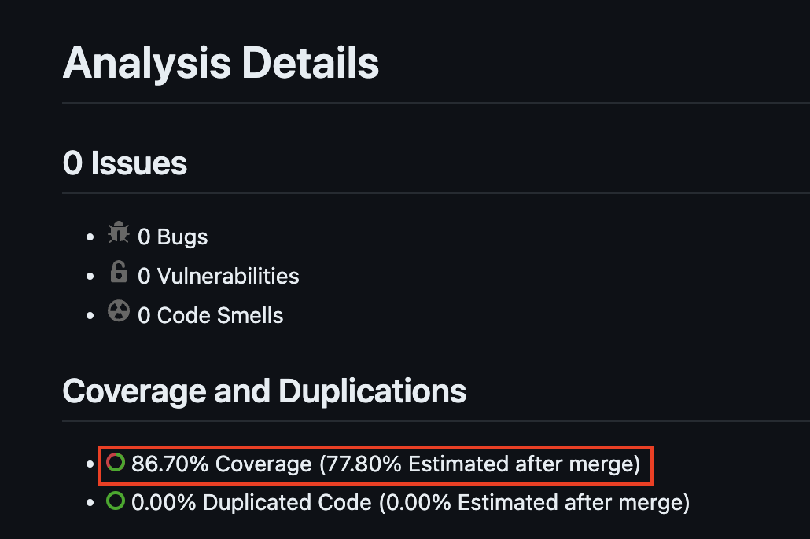
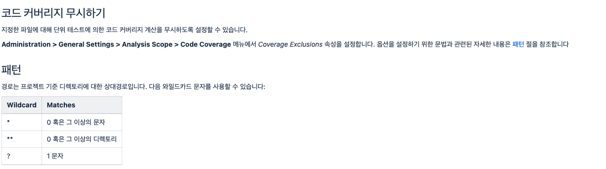
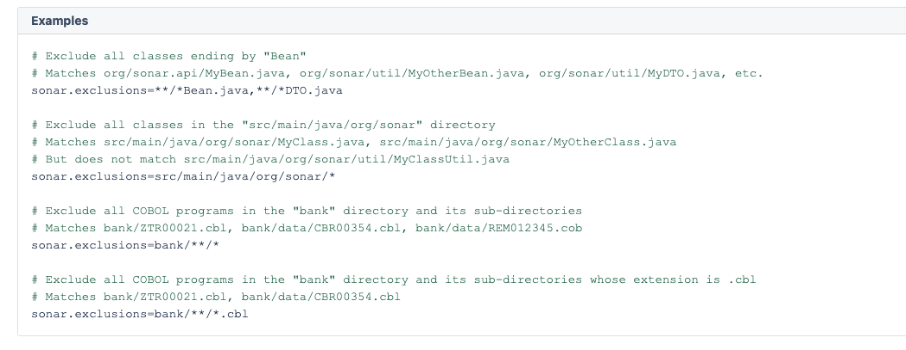
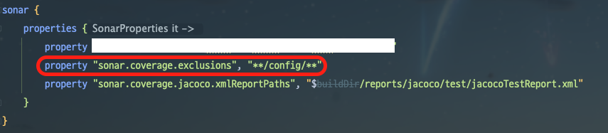

## 문제와 해결
사이드 프로젝트에 스프링 시큐리티를 적용하기 위해 기본적인 Security Config 파일(WebSecurityConfig.java)를 생성하였었다.

그 후 TDD로 개발을 진행하는데, 소나큐브 + jacoco에서 테스트 커버리지 대상에 `Config` 파일도 포함시켰다. 


Config 파일에 대한 테스트가 없기 때문에 86.70%가 나왔다.

나는 Configuration 클래스들에 대해서는 TDD로 작성할 생각이 전혀 없었기 때문에 해당 클래스를 커버리지 대상 파일에서 제외해야했다.


- sonarqube: 4.4.1.3373
- jacoco: 0.8.8

열심히 구글링, Chat GPTing을 한 결과 제외 방안 다음과 같다.

```gradle
jacocoTestReport {
	dependsOn test

	reports {
		xml.required = true
		html.required = true
	}

  // 이 아래 부분이 테스트 커버리지에서 제외하는 코드이다.
	afterEvaluate {
		classDirectories.setFrom(files(classDirectories.files.collect {
			fileTree(dir: it,
					exclude: [
							'**/config/**'
			])
		}))
	}
}
```

이 방법은 다양한 곳에서 알려주고 있지만, 나에게는 전혀 효과 없었다. 어떠한 에러도 로그도 발생하지 않기 때문에 참 답답했다. 왜 나만 안되는걸까..

구글링과 지피팅이 모든 정보를 빠르게 알려주는 시대지만 오랜만에 공식문서를 찾아 보기로 했다.
웬걸.. 몇 시간 동안 고생하던 문제가 공식문서를 펼치고 5분안에 해결됐다.

[소나큐브 분석범위 좁히기 공식문서](https://sonarqubekr.atlassian.net/wiki/spaces/SON/pages/428055?showComments=true&showCommentArea=true#id-%EB%B6%84%EC%84%9D%EB%B2%94%EC%9C%84%EC%A2%81%ED%9E%88%EA%B8%B0-patte)


이와 같이 본인의 소나큐브에 접속해서 GUI로 직접 설정하거나,



build.gradle에서 소나큐브의 property로 `sonar.exclusions`를 등록해주면 된다.



## 나가며
요즘 AI (LLM)이 너무 잘 되어있고, 속도가 빠르다보니 중요한 걸 놓친 기분이다. GPT가 막 상용화된 초창기에는 구글링과 GPT보다 공식문서로 해결하는 게 빠르다는 걸 많이 느꼈었는데 요즘은 GPT에게 원하는 답을 들을 때까지 GPT에게만 죽일 기세로 물어본다.

하지만 GPT는 학습된 언어모델일 뿐이고, 내가 진짜 원하는 건 내 머릿속에 있다. 내가 프롬프트 엔지니어가 아닌 이상 정말 내가 원하는 것을 얻기 위해서는 내가 직접 찾아보는 게 더 정확하고 빠른 것 같다.

다시한번 공식문서가 개발자에게 얼마나 중요한 지 깨달았다. 아직까지 GPT가 정확도 측면에서는 부족한 것 같기도 하다.

이 글에서 다룬 해결방법도 며칠 몇달이 지나면 금방 레거시가 되어 다른 사람들에게 도움이 안 될 수 있다. 과거 기록과 과거 블로그, 과거에 학습된 모델에 의존하지 말고 현재가 가장 잘 반영된 공식문서를 먼저 찾아보자.