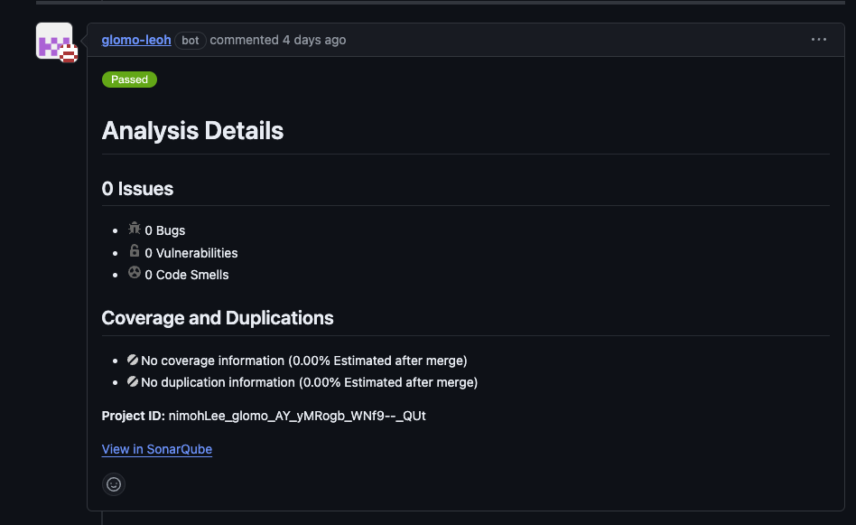

프로젝트 개발에 Sonarqube를 사용하려고 한다. 특히나 1인 프로젝트이기 때문에 코드 품질에 대해 스스로 피드백하고 개선하는데에 한계가 있다.

### 소나큐브가 뭐하는건가?
소나큐브(Sonarqube)는 대표적인 정적분석도구이다. "정적분석도구"라는 단어가 생소하거나 직관적이지 않을 수 있다. **정적분석도구**는 말 그대로 정적 코드를 분석하여 버그, 코드 스멜, 보안 취약점 등을 분석하여 코드 품질을 검사해주는 도구이다. 보통 모니터링이라 하면 애플리케이션의 런타임을 분석하는데, 정적분석도구는 런타임 이전인 정적인 코드 그 자체에 대해 분석한다.

정적분석도구 중 소나큐브를 선택한 것은 가장 커뮤니티가 활성화되어있기 때문이다.

### 개발기에 적용하기
소나큐브에는 PR Decoration 기능이 있다. Github와 같은 형상관리 툴에 PR(Pull Request)가 발생하면, 해당 코드를 분석한 결과를 PR Conversation으로 작성해준다.
하지만 이 기능은 무료버전인 Community 버전에서는 불가능하다. 따라서 누군가가 만들어 준 PR Decoration 플러그인을 사용해야 한다. ([sonarcube-community-branch](https://github.com/mc1arke/sonarqube-community-branch-plugin))

혼자 개발하기 때문에 코드 리뷰를 받을 일이 거의 없다. 때문에 Pull Request를 할 필요도 사실 없다. 하지만 Sonarqube가 정적분석을 해주면 Pull Request를 해야할 **필요**가 생겼고, 브랜치 전략도 어느정도 도전해볼만해진다. 

그래서 코드가 수정되어 PR을 하면 Sonarqube가 Passed될 때까지 수정하고, Sonarqube의 분석 외에도 내 코드를 한 번 더 리뷰해보는 과정을 거친 다음 merge할 생각이다.

이 과정이 2주 정도 걸렸다.. 삽질을 굉장히 많이했는데, 이유는 Jenkins, Github action의 미숙이었다. 처음에 생각한 프로세스는 PR이 발생하면 Github Webhook을 통해 Jenkins의 빌드를 유발시키고, Jenkins에서 Sonarqube를 통해 정적분석을 한 뒤 PR Decoration을 작성하는 것이었다.

그런데 생각해보니 굳이 그럴 필요가 없었다. Github PR Decoration을 사용하려면 Github Action과 Github App을 사용했어야 하는데, 이 둘을 사용하면 Jenkins를 거칠 필요도 없었다. Jenkins는 PR이 Merge되면, 빌드 및 배포를 위해 사용하면 된다.

### 삽질하며 느낀점
꽤 스트레스 받으며 삽질을 했는데, 그 근본적인 원인이 무엇인가 생각해보니 아마도 리눅스와 쉘 스크립트에 대한 미숙함인 것 같다. 리눅스는 업무에서 정말 쓰는 것만 쓰고 있고, 쉘 스크립트를 작성할 일이 거의 없어서 무지에 가깝다. 

CI/CD를 구축하며 도커, 젠킨스 등을 활용하는데 리눅스와 쉘 스크립트는 필수였다. 나중에 애플리케이션을 모니터링하거나 로그를 추적하는 등 많은 자동화가 필요할 수 있다. 현재 프로젝트가 설계단계인데 개발에 들어가기 전에 쉘 스크립트에 대한 공부를 하고 진행해야겠다.

Sonaqube PR Decoration 구축 참고: https://dlwnsdud205.tistory.com/350