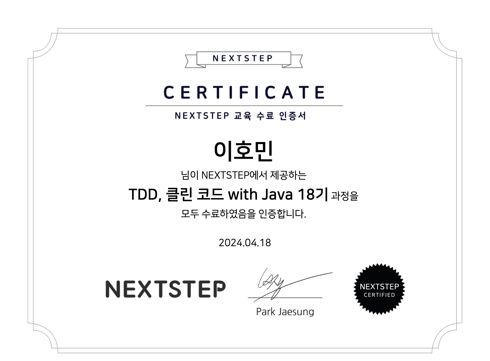

## 수료 🥳 🎉

주어진 기간안에 미션을 모두 완료했다! 어려웠지만 리뷰어님들과 포비님의 응원 및 리뷰 덕분에 잘 완료되었다. 그런데 썩 마음에 들지 않는 내 코드들이 있다. 이 부분들은 개인적으로 수정해볼까 한다. 막판에 조금 아슬아슬하긴 했지만 어쨌든 성공적으로 마무리해서 뿌듯하다.

## 과정에 대한 소감
개발문화가 괜찮다고 하는 회사들의 얘기를 들어보면 개발 후 PR(Pull Request)를 하고, 개발자 서로의 코드를 리뷰해주는 문화를 가지고 있었다. 나는 현재 2년차에 접어든 재직자이지만 코드 리뷰같은 건 받아보지 못했다. 기능에 문제가 있지 않는 이상 아무도 내 코드에 태클걸 지 않았다. 

> "저러면 싸움나는 거 아니야...?" 

코드리뷰라는 걸 알았을 때 내 처음 생각은 이랬다. 만약 누가 내 코드에 자꾸 딴지(?)를 걸면 감정적으로 화나거나 짜증날 것이라 생각했다.

그래서 궁금했다. 개발 문화가 좋은 회사들을 왜 코드 리뷰라는 행위를 하는 것일까?

이 과정을 수료한 것 TDD, 클린코드를 익히는 것도 물론 중요했지만 **코드리뷰에 대한 관심**이 크게 작용했다.

그 결과, 왜 그들이 코드 리뷰라는 문화를 채택했는 지 어렴풋이나마 알게됐다.

1. 나의 객관적인 개발 수준을 알 수 있다.

누군가가 내 코드를 봐주지 않으면 내 수준과 내 코드가 어떤 지 알기 어렵다. 물론 책이나 정적분석 도구를 통해 조금씩 고쳐나갈 수는 있지만, 내 수준의 위치를 알기에는 어려울 것 같았다.

2. 실력이 향상된다.

당연한 얘기겠지만 누군가가 내 코드를 보고 "이렇게하는 것보다 저렇게 하는 게 더 나아보이는데 어떻게 생각하세요?" 라고 하면 그에 대해 의견을 나누게 된다. 그럼 좀 더 생산적인 대화가 가능하고, 더 좋은 결론에 도달하게 된다. 그러면서 자연스레 개발자의 실력은 향상될 것 이다.

3. 개발자 커뮤니티(혹은 팀워크)가 형성되기에 좋다.

실제로 회사에서 코드리뷰를 해본 적은 없지만, 한다면 그 팀원과 코드나 기술적인 얘기를 하며 팀워크가 생길 것 같다는 생각이 든다. 회사가 아니더라도 코드리뷰를 해주는 사이라면 지식을 공유함으로써 좋은 관계를 이룰 수 있을 것 같기도 하다.

## 아쉬웠던 점

과정에 대한 아쉬운 점보다 나에게 아쉬운 점이다. 과정 초반에는 설레기도 하고 의욕이 넘쳐서 참 열심히 했다. 뒤로 갈수록 이런저런 핑계가 생기고, 어려워져서 온전히 집중하지는 못했던 것 같다. 결과적으로는 기간내에 미션을 완료했지만, 조금 급하게 한 것도 있다. 그리고 오히려 너무 잘하려고 하다보니 리뷰를 받을 수 있는 기회가 적지않았나 싶다. 다시 과정을 하게된다면 **완벽하게 하려고 노력하기보다는 부족한 코드라도 여러번 리뷰요청해서 많은 피드백을 받아볼 것 같다.** 

## 나가며
나는 해당 과정의 18기 수료이다. 내가 18기라면 이 과정을 이수한 사람이 필드에 꽤 많을텐데, 꼭 같이 개발해보고 싶다. 동료가 되진 못 하더라도 사이드 프로젝트나 스터디 등 같이 해보고 싶다. 같은 개발철칙(?)을 가지고 나와 비슷한 방향으로 성장하려는 개발자를 실제로 만나는 것은 어려운 일이다. 그래서 오프라인 짝프로그래밍을 하는 과정에서 사람들에게 적극적으로 다가갔다면 어땠을까 후회아닌 후회가 남는다.

다음에 다른 개발자들을 만나 같이 공부할 기회가 생기면 그들에게 물어봐야겠다.
> 혹시 NEXTSTEP TDD + 클린코드 수료하셨어요?

