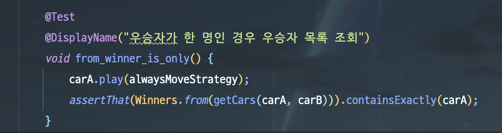
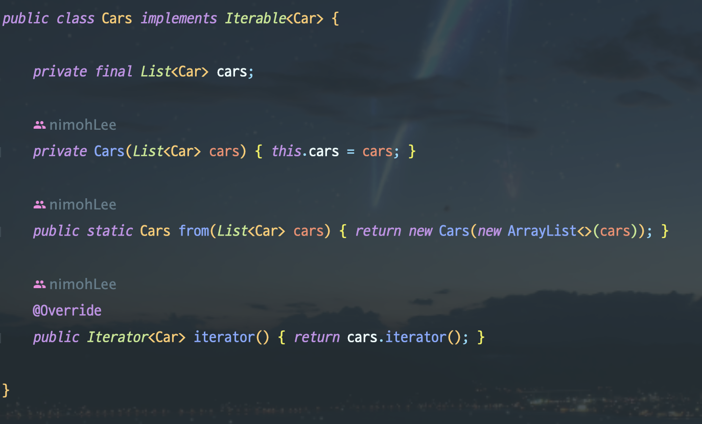
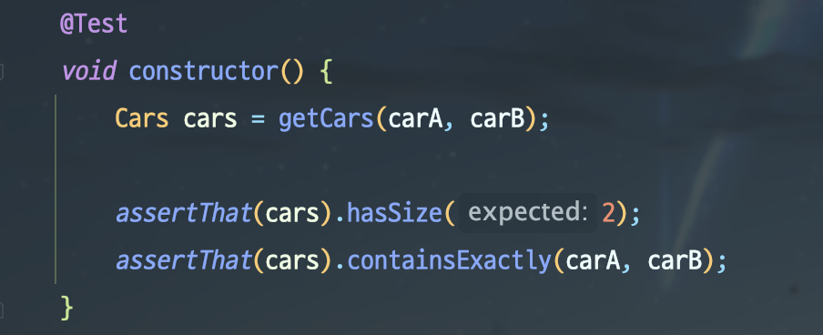

## 피드백 정리
### 1. getter를 지양하자

과제를 구현하다보니 화면 출력 기능에는 도저히 `getter`가 없으면 안 될 것 같았다. 해당 도메인 객체에 출력하는 책임을 부여한다면 `getter`는 필요없겠지만, 과연 그것이 객체지향적일까? `getter`를 만드는 것과 출력의 책임을 부여하는 것. 그 사이에서 고민이 많았다. 출력의 책임은 출력 객체에서 오롯이 관리하고 출력을 위한 `getter` 정도는 괜찮겠다 생각해서 만들어줬다.

그러다보니 다음과 같이 출력이 아닌 코드에도 생각없이 `getter`를 사용하게 되었다.

```java
 public List<Car> getWinnerList() {
        return  cars.stream()
                .filter(car -> car.getPosition() == maxPosition());
```

`getter`가 있으니 쓰면 되겠다 라고 생각해서 쓴건데 사실 이런 단순 비교에는 `samePosition()` 같은 메서드로 `getter`없이 요청할 수 있었다.

```java
 public List<Car> getWinnerList() {
        return  cars.stream()
                .filter(car -> car.samePosition(maxPosition));
```

`getter`가 있어도 내가 안 쓰면 되지~ 라고 생각했는데 내가 쓰고 있었다. 만약 내가 아닌 다른 개발자가 해당 도메인 객체를 사용한다면 `getter`를 사용하지 말라는 주석가지고는 그의 코딩을 막을 수 없을 것이다.

결론은 **그냥 웬만하면 `getter`를 만들어놓지도 말자** 이다. `getter`를 미리 만들어뒀기 때문에 간단하게 `samePosition()`을 생각할 수도 있는데도 무작정 getter를 꺼내서 절차지향적으로 개발했다.

### 2. 테스트 의도를 쉽고 빠르게 이해할 수 있도록 이름을 잘 지어주자
 
다음과 같은 테스트 코드가 있다.
```java
   @Test
    void getWinnerList_one_winner() {    
        // given
        Cars cars = getCars(carA, carB);
        carA.play(alwaysMoveStrategy);

        // when
        List<Car> winnerList = cars.getWinnerList();

        // then
        assertThat(winnerList).containsExactly(carA);
    }
```
getWinnerList.. one winner?? 우승자 리스트를 가져와서 하나의 우승자..? 무슨 말이지?

물론 내가 작성한 코드기 때문에 나는 안다. 그런데 만약 수많은 테스트를 다른 개발자가  한 꺼번에 돌렸을 때, 이 테스트가 실패한다면 메서드의 의도를 파악하기 어렵다. 코드를 작성한 사람에게 물어보거나, 코드를 분석해야한다.


영어를 잘 못하면 그냥 한글로 메서드를 자세히 적든가, `@DisplayName`으로 자세히 알려주자. 개발은 나만 하는 것이 아니다. 심지어 나도 나중에 가면 무슨 테스트였는 지 까먹는다.



이제 테스트가 실패하는 상황에 대해 한 번에 알아볼 수 있게 되었다.

### 3. 일급컬렉션과 Iterable
#### 일급컬렉션
일급컬렉션이란 자바 컬렉션 하나 만을 멤버변수로 가지고 있는 객체를 말한다. 예를 들면 다음과 같은 객체이다.
```java
public class Cars {
    private final List<Car> cars;
    
    private Cars(List<Car> cars) {
        this.cars = cars;
    }

    public static Cars from(List<Car> cars) {
        return new Cars(new ArrayList<>(cars));
    }
}
```
일급컬렉션을 사용하면 다음과 같은 장점이 있다.
1. 컬렉션의 불변성을 보장하기 쉽게 해준다. 

위의 `Cars` 를 보면 `List<Car> cars`는 final로 선언되어 객체가 생성될 때만 들어가기 때문에 불변을 보장한다.

2. 컬렉션에 비즈니스 로직을 추가할 수 있다.

보통 `List`나 `Map`, `Set` 등의 컬렉션을 사용하다보면 해당 컬렉션의 메서드가 아닌 데이터 검증, 비즈니스에 종속적인 로직 등이 필요한 경우가 있다. 이 때, 일급컬렉션을 사용하지 않으면 코드가 상당히 절차지향적으로 작성된다.

```java
  List<Car> cars = new ArrayList<>();
  Car car = new Car("exception");
  
  if (car.sameName("exception")) {
    throw new IllegalStatementException();
  }

  cars.add(car);
```
하지만 일급컬렉션을 사용하면 다음과 같다.

```java
  // 클라이언트 코드
  Cars cars = Cars.from(new ArrayList<>());  
  cars.addCar(new Car("exception"));

  // 일급컬렉션 Cars
  public class Cars {
      private final List<Car> cars;
      ...

      public void addCar(Car car) {
          if (car.sameName("exception")) {
                throw new IllegalStatementException();
          }
          cars.add(car);
      }
}
```

이렇게 `Cars`에 들어가는 `Car`를 `Cars`에서 검증하게 되면서 책임이 나눠지며 클라이언트 코드는 줄고, 비즈니스에 종속적인 자료구조가 탄생한다.

#### Iterable
클래스가 `Iterable`을 구현하게 되면 객체를 순회할 수 있게된다.



`Cars`의 경우 `Car`의 List를 감싼 일급컬렉션이기 때문에 구현할 때 `Iterable<Car>`와 같이 작성하면 된다. 그리고 순회를 해야하므로 `iterator()`를 오버라이딩 해주면 사용 준비완료이다.

그런데 이 방법에는 문제가 있다. 일급컬렉션 역시 도메인 객체인데, `Cars`의 내부에 있는 `Car`를 순회하며 접근하는 것이 과연 객체지향적일까에 대한 문제이다.

리뷰어님은 도메인 객체라면 메시지를 보내는 방식을 선호하신다고 하셨다. 즉, `iterable`을 구현하여 순회하는 것은 메시지를 보내는 게 아니라, 내부 변수를 꺼내보는 것이라고 하셨다. 

하지만 내 생각은 조금 달랐다. 일급컬렉션도 어쨌든 컬렉션인데, 내부 값들을 보지 못하면 컬렉션이 무슨 소용인가 싶었다. 컬렉션을 감쌌기 때문에 일급 컬렉션인건데, 불변성과 비즈니스 로직등을 추가해서 비즈니스 종속적인 컬렉션이면 일급컬렉션의 장점을 살려 구현한 것 아닐까? 굳이 순회를 막으며 내부 요소들에 대한 접근까지 못하게 하는 것은 비효율적이라고 생각한다.

또, `Iterable`을 구현하면 테스트할 때 다양한 메서드를 사용할 수 있다.


간단하게 예를 들면, 위와 같이 컬렉션 메서드를 사용할 수 있다.
만약 `Cars`가 `Iterable`을 구현하고 있지 않다면, `hasSize(), containsExactly()`가 아니라 테스트 때문에 `Cars`에 `size()`와 `contains()` 를 구현해줘야할 것이다.

## 모짝미, 네트워킹 데이
어제 NEXTSTEP 과정에서 오프라인 모짝미를 진행했다. 개발자라면 다들 모각코(모여서 각자 코딩)는 알 것이다. 모짝미는 모여서 짝지어서 미션의 줄임말이다. 각자가 아니라 짝 프로그래밍(Pair Programming)을 하는 것이다. 나는 짝 프로그래밍을 해본 적이 없기 때문에 약간 긴장 반 설렘 반으로 선릉역으로 향했다. 우아한 테크코스도 그 건물에서 진행되는 지, 장소가 우테코로 도배되어 있었다. 부러웠다...

**포비** 박재성님과 **제이슨** 박재성님을 실제로 뵙게 되어 신기했다. 네트워킹데이라고 한 시간 정도 참가자들이 미리 작성한 질문에 대해 대답해주시는 시간이 있었는데, 감명깊게 들었다. 다들 비슷한 고민이고 나만 힘든 게 아니구나 싶었다. 포비님이 비전공자분이 CS 관련해서 질문을 주셨는데, 전공자라고 CS 잘하는 거 아니라고 하셨다. 내 얘기같아서 웃음이 났다. 

그리고 나와 미션 진행 단계가 같은 분과 짝 프로그래밍을 진행했다. 짝 프로그래밍에는 `Driver(운전수)`와 `Navigator`가 있다. 드라이버는 키보드를 놓고 직접 코딩하는 사람을 말하고, 네비게이터는 옆에서 훈수(?)두는 사람을 말한다. 10분 간격으로 이 역할을 번갈아가며 했다. 짝으로 같이 하신 분이 `Enum`타입에 `BiFunction`을 사용해서 `Enum`에 비즈니스 로직을 넣으셨는데 무척 인상깊었다. 그 코드로, if 문으로 떡칠 되어있던 클라이언트 코드를 단 한 줄로 수정할 수 있었다.

## 후기
좋은 경험이었다. 다른 개발자와 개발적인 대화를 나눌 수 있는 것이 좋았다. 혼자 개발공부 하면서, 내가 잘 하고 있는 건지 내 위치를 어느정도 되는 지 가늠하기가 어렵다. NEXTSTEP 측에서 좋은 자리를 마련해줘서 좋았고, 2주뒤에 있을 모짝미에도 참여하려고 한다. 정말 커리큘럼 비용이 1도 아깝지 않다.