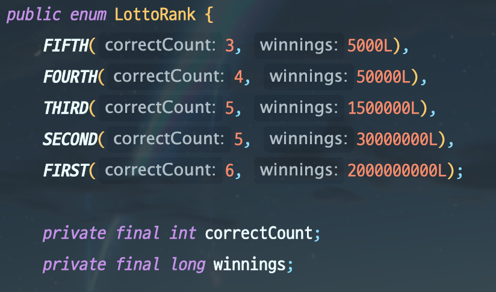
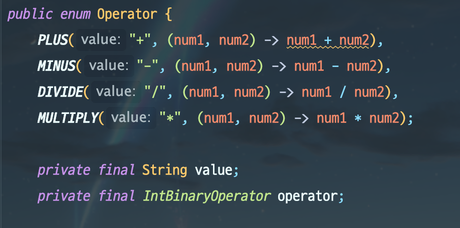
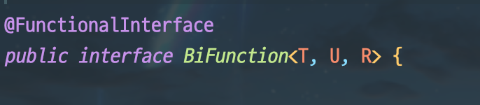
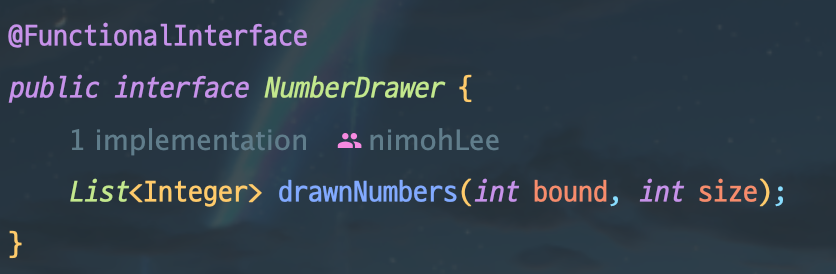

NEXTSTEP 과정을 시작한 지 벌써 3주가 지났다. 시간이 어떻게 가는 지도 모르겠다.

이번 주도 과정을 진행하며 받은 피드백을 정리해보고 나름의 회고를 해보려고 한다.

## 피드백 정리

### 1. Enum과 함수형 인터페이스
개발하다보면 어떤 상수에 대한 상태를 관리해야하는 경우가 있다. 예를 들어, 로또 등수에 대한 경우이다. 어떤 경우인 지 코드로 알아보자.


enum 내부에 선언된 각각은 로또의 등수를 나타내는 클래스이며, 변하지 않는 상태를 가지고 있다. 
위의 경우 로또 5등(FIFTH)는 3개의 숫자(`correctCount`)가 맞아야하고, 그에 따른 상금은 5000원(`winnings`)이다.

굳이 이렇게 나타내야하나 싶겠지만, enum에는 중요한 특성이 있다. 바로 각각이 싱글턴 객체라는 것이다. 그렇게 때문에, 동일한 enum은 `==`과 같은 동일성 비교에서 항상 True이다. 당연히, 같은 LottoRank라도 순위가 다르면 동일하지 않다.

```java
LottoRank.FIFTH == LottoRank.FIFTH; -> true
LottoRank.FIRST == LottoRank.FIFTH; -> false
```

이렇듯 enum을 사용하면 상태를 나타내는 상수들을 묶어 싱글턴 객체로 사용할 수 있는 이점이 있기 때문에 나 역시 이런 방법으로 자주 사용해왔다.

하지만, 내가 오늘 작성하고자 하는 것은 `상태`가 아니라 `행위`에 대한 것이다.

자바 8부터 enum의 상수에 **함수형 인터페이스**가 들어갈 수 있게 되었다.



`LottoRank`는 `correctCount`, `winnings`라는 상수 상태값만 가지고 있었다. `Operator`는 `operator`라는 `IntBinaryOperator`를 가지면서 할 수 있는 행위를 상수로 가지게 되었다.

함수형 인터페이스 `IntBinaryOperator`에 대해 간략하게 설명하자면 `BiFunction`의 모든 인자가 int 타입일 때 사용할 수 있다. 

`BiFunction`은 두 개(Bi)의 인자를 받아, 하나의 결과를 반환하는 함수형 인터페이스이다.


`T` 타입과 `U` 타입을 인자로 받아, `R` 타입으로 반환하는 함수이다.
그럼 `IntBinaryOperator`에 감이 잡혔을 것이다. `IntBinaryOperator`는 `T`와 `U`, `R`이 모두 `int` 타입(Integer 포함) 일 때 대신 사용할 수 있는 함수이다.

다시 본론으로 돌아가서, 우리는 함수형 **인터페이스**를 클래스의 필드로 선언한 상태이다. 그런데 인터페이스는 그저 명세이기 떄문에 항상 구현체가 필요하다. `IntBinaryOperator` 경우도, int 인자 두 개를 받아서, int를 반환한다는 명세만 있을 뿐 **실제 계산식**은 어디에도 없다. **실제 계산식(구현)**을 Enum의 각 클래스에 넣어주는 것이다!

`(num1, num2) -> num1 + num2`는 `IntBinaryOperator`의 구현체다. 구현체라면 객체의 형태를 해야하지만, 익명구현체를 람다식으로 표현하면서 이렇게 간소화할 수 있다. 람다를 사용하지 않으면
```java
new IntBinaryOperator(){
  @Override
  int applyAsInt(int left, int right) {
    return left + right;
  }
}
```
라는 익명 구현체가 `(num1, num2) -> num1 + num2` 대신에 들어가야한다. 코드가 너무 지저분해지지 않겠는가? 그래서 함수형 인터페이스, 스트림, 람다를 사용하면 코드가 깔끔해진다는 장점이 있기 때문에 공부하고 사용하는 것이 좋다.

물론 함수형인터페이스는 다음과 같이 직접 만들어도 된다.

이 때, `@FunctionalInterface`를 붙여주도록 하자. 별 기능은 없지만 함수형 인터페이스임을 명시해줌으로써 좋은 명세가 될 수 있다.

어쩌다보니 1번이 너무 길어졌다. 빨리 넘어가도록 하겠다.

### 2. 상수 클래스 지양과 값 객체
`로또` 과정을 진행하다보니 객체 이곳 저곳에 상수가 필요한 경우가 있었다. 예를 들어, 로또 최소 번호와 최대 번호라든가 로또 하나에 몇 개의 번호가 있어야하는 지 등이다. 최초 설계 시에 각 상수들이 이 곳 저 곳에서 사용되어 어쩔 수 없이 상수만을 사용하는 클래스를 생성했다.

```java
public class LottoConstants {
    public static final int LOTTO_NUMBER_SIZE = 6;
    public static final int MIN_LOTTO_NUMBER = 1;
    public static final int MAX_LOTTO_NUMBER = 45;
    public static final int LOTTO_PRICE = 1000;
    public static final long THREE_NUMBER_CORRECT_WINNINGS = 5000L;
    public static final long FOUR_NUMBER_CORRECT_WINNINGS = 50000L;
    public static final long FIVE_NUMBER_CORRECT_WINNINGS = 1500000L;
    public static final long SIX_NUMBER_CORRECT_WINNINGS = 2000000000L;
}
```

이 코드를 작성한 후 받은 피드백은 상수 클래스가 생긴다는 것은 설계가 잘못되었을 수도 있다는 징조라는 것이다. 여기서 설계라는 건 어떤 책임을 어떤 객체가 가지고 있냐의 문제를 말한다.

처음에는 감이 안 잡혔다. 각 상수들은 검증 또는 생성을 위해 꼭 필요한 정보였고, 내 로직 상 분명이 어디선가 저 상수를 가지고 있어야 했다. 이 모든 문제들은 값 객체를 사용하며 정리되었다.

저 당시 나의 로또 객체들은 다음과 같은 포함관계를 가지고 있었다.
```java
- 수정 전

숫자 하나(Integer) -> 로또 한 줄 (LottoNumber) -> 로또 여러 줄(LottoNumbers)
```
이러다보니 입력값이 로또 최소 번호, 최대 번호의 범위에 드는 지 검증을 외부에서 해야했다. 마땅히 내부라고 할 만한 것도 없었다. 숫자 하나를 **값 객체**로 변경하면서 각 클래스명도 수정해주었다.
```java
- 수정 후

숫자 하나(LottoNumber) -> 로또 한 줄 (LottoNumbers) -> 로또 여러 줄(LottoTicket)
```
이제 숫자 하나하나가 범위에 드는 지는 `LottoNumber`의 생성 시점에 검증해줄 수 있게 되었다. 즉, 위의 `MIN_LOTTO_NUMBER` 와 `MAX_LOTTO_NUMBER`는 `LottoNumber`라는 집이 생겼다.

이런 식으로 나머지 상수들도 `LottoNumbers`, `LottoResult`, `LottoRank` 등 각각의 집으로 들어갈 수 있었다.

### 3. 인자는 적을 수록 좋다
클린코드에서 메서드 매개변수의 개수에 대해 다음과 같이 말한다. 매개변수의 개수는 0개가 가장 좋고, 그 다음이 1개, 다음이 2개이다. 3개는 되도록이면 사용하지 말아야 하고, 4개 이상은 특별한 일이 있어도 사용하지 말아야 한다.

매개변수가 3개 이상인 경우, 연관된 매개변수끼리 별도의 클래스로 분리해보자.

### 4. 값 객체 인스턴스 캐싱
`LottoNumber`라는 값 객체는 `MIN_LOTTO_NUMBER`와 `MAX_LOTTO_NUMBER` 사이의 범위에서만 생성된다. 1~45라고 한다면 45개의 객체 인스턴스만 있으면 된다는 뜻이다. 그런데 만약, 만 명의 접속자가 로또를 10개씩 산다고 하면 몇 개의 `LottoNumber`가 생성될까? 로또 하나 당 6개씩이니까.. 한 명당 60개에 만명이면.. 60만개.. 인스턴스가 60만개가 생성된다. 

값 객체는 불변객체이고, 인스턴스 변수가 같으면 논리적으로 같은 객체이다.
```java
LottoNumber.valueOf(1).equals(LottoNumber.valueOf(1)) -> true
```
즉, 1과 1은 같은 로또 번호인데 서로 다른 인스턴스를 또 생성해야할 필요가 있냐는 문제이다.

이 때, 인스턴스 캐싱을 통해 인스턴스 생성 개수를 확 줄일 수 있다. 코드로 먼저 보자.

```java
public class LottoNumber {
    public static final int MIN_LOTTO_NUMBER = 1;
    public static final int MAX_LOTTO_NUMBER = 45;

    private final int value;
    private static final Map<Integer, LottoNumber> LOTTO_NUMBER_INSTANCE = new HashMap<>();

    static {
        for (int i = MIN_LOTTO_NUMBER; i <= MAX_LOTTO_NUMBER; i++) {
            LOTTO_NUMBER_INSTANCE.put(i, new LottoNumber(i));
        }
    }

    public static LottoNumber valueOf(int value) {
        return LOTTO_NUMBER_INSTANCE.get(value);
    }

    private LottoNumber(int value) {
        this.value = value;
    }
}
```

간단히 하기 위해 기타 검증 코드들은 제외했다. `LOTTO_NUMBER_INSTANCE`라는 상수 `HashMap`에 처음부터 각각 1~45를 가지는 `LottoNumber`를 미리 생성하여 넣어놨다. (캐싱) 따라서, 이제 `LottoNumber`를 생성하려고 할 때마다, 미리 만들어 둔 `LottoNumber`를 `LOTTO_NUMBER_INSTANCE`에서 찾아 반환해주면 된다.

여기서 하나 중요한 것은 값 객체는 항상 `equals()`와 `hashCode()`를 재정의해줘야 한다. 자세한 내용은 이펙티브 자바의 아이템 10, 11을 참조하길 바란다. 어쨌든, `HashMap`, `HashSet`과 같은 해시 기반 컬렉션에서는, `hashCode()`를 통해 객체를 찾는데, `hashCode()`가 재정의되어 있지 않으면 `LOTTO_NUMBER_INSTANCE`라는 `HashMap`에서 우리가 원하는 `LottoNumber`를 찾을 수 없다.

어쨌든, 60만개가 생성되던 `LottoNumber`를 45개로 줄였다. 이런 방식은 원시타입의 Wrapper 클래스도 사용 중인데, 
자바의 `Integer`같은 경우는 -128 ~ 127을 미리 캐싱해두고, `valueOf()` 호출 시 캐싱해둔 값을 반환한다. 만약 `new Integer()`와 같은 방식으로 boxing 한다면 캐싱은 사용하지 않기 때문에 웬만하면 `valueOf()` 사용을 권장한다. 다른 Wrapper 클래스도 마찬가지이다.

## 회고
하나 둘 피드백을 정리하다보니 이번 포스팅이 너무 길어졌다. 모든 피드백을 다 담지도 못했는데 이렇게 길어졌다는 것은 그만큼 이 과정을 통해 얻어가는 게 많다는 의미로 느껴진다.

하나 걱정되는 것은, 내가 너무 빨리 끝내고 리뷰요청을 하려고 한다는 점이다. 첫 번째 미션인 자동차 경주가 오히려 더 어려웠다고 느껴지는 게, 처음 하다보니 고민거리가 굉장히 많았고 그래서 단계 하나에 4~5시간 씩 쓰고 그랬다. 그런데 조금씩 익숙해지다보니 최대 2시간이면 단계 하나가 끝나는 기분이다. 물론 피드백도 많이 받지만, 피드백 반영도 금방금방 끝나는 것 같다. 빨리 구현하고 피드백을 반영하니까 오히려 뭔가 잘못된 게 아닐까 하는 걱정이 된다. 좀 더 고민하고 좀 더 파고들었어야 했나? 라는 생각도 든다.

빨리 단계를 수행하는 덕분에 이펙티브 자바를 조금씩 보고 있긴 한데, 오히려 걱정되는 게 있다.

가장 큰 걱정은, 이렇게 빨리 수행하는 방법으로 진행하다가 과정이 모두 종료된 뒤에 다 잊어버리는 것이다. 매주 일요일마다 정리하고 있긴 하지만 왠지 걱정이된다.