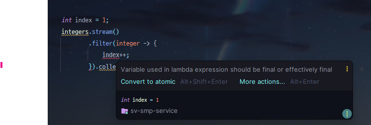

이번 주는 내가 코딩테스트 공부를 하느라, 그리고 리뷰어님이 바쁘신 지 리뷰가 늦어져서 진행이 많이 안 됐다. 근 2주 동안 속도가 더뎌진 듯 하다. 얼마 안 남았으니 최대한 마무리 해야지!

## 피드백 정리
### 스트림은 순수 함수 모음이다
자바의 Stream은 자바에서 여러 함수를 모아 함수형 프로그래밍을 할 수 있도록 도와주는 API이다. 함수형 프로그래밍은 말 그대로 함수가 주가 되어, 함수 재사용을 강조하는 패러다임이다. 이 때 중요한 것은 이 함수가 순수함수여야한다는 점이다. 

순수 함수는 동일한 입력에 대해 항상 동일한 출력을 반환하고 내부, 외부 상태에 의존하지 않는 함수이다. 함수가 실행되어도 시스템의 상태를 변경하지 않기 때문에 함수가 전역 변수를 변경하거나, 파일 시스템에 쓰기, 네트워크 요청을 보내는 등의 작업을 수행하지 않는다. 즉, Side Effect가 없다는 뜻이다.

순수함수를 사용하게 되면 위와 같은 특성 덕분에 예측 가능하고, 테스트하기 쉬우며 재사용 및 유지보수하기 좋다.

이제 갑자기 왜 이 함수형 프로그래밍에 대해 얘기했는 지 말해주겠다.

```java
    private Players inputPlayers(String message) {
        System.out.println(message);
        List<String> nameList = StringUtil.splitStringToList(SCANNER.nextLine(), INPUT_DELIMITER);
        AtomicInteger index = new AtomicInteger(INITIAL_INDEX);
        try {
            List<Player> playerList = nameList.stream()
                    .map(name -> Player.of(name, index.getAndIncrement()))
                    .collect(Collectors.toList());

            return Players.from(playerList);
        } catch (IllegalArgumentException e) {
            return inputPlayers(e.getMessage() + TRY_INPUT_AGAIN);
        }
    }
```
위 코드는 Scanner를 통해 문자열을 입력받고, Players로 변환하여 반환하는 자바메서드이다.여기서 눈 여겨보아야 할 코드는 
```java
...
AtomicInteger index = new AtomicInteger(INITIAL_INDEX);
        try {
            List<Player> playerList = nameList.stream()
                    .map(name -> Player.of(name, index.getAndIncrement()))
                    .collect(Collectors.toList());
...
```
이 부분이다. 스트림 내부에서 정수 index를 증가 시키기 위해 스트림 외부에 `AtomicInteger`를 사용하였다. 이 부분에서 문제가 발생한다. 기능적인 결함이나 버그는 발생하지 않지만, 더 이상 스트림이 순수함수가 되지 않는 문제가 있다.

#### `Atomic`
`Atomic`은 원자라는 뜻이다. 따라서 `AtomicInteger`는 Integer의 원자성을 보장하는 버전이라고 할 수 있겠다. 여기서 원자성을 보장한다는 것은 DB 트랜잭션과 유사한데, 멀티 쓰레드 환경에서 A 쓰레드가 해당 변수를 업데이트 동안 B 쓰레드는 업데이트를 할 수 없다.

`Atomic` 클래스들은 내부적으로 Compare-And-Swap(CAS)라는 메커니즘을 통해 값을 업데이트 한다. 직역해보자면, **비교하고 바꾸고** 라고 볼 수 있겠다. 뭘 비교하고 뭘 바꾸는 지 간단하게 알아보자.
CAS는 다음과 같은 과정으로 작동한다.
1. 읽기: 변수의 현재 값을 읽음
2. 비교: 연산을 수행하기 직전에 읽은 값이 1번 과정에서 읽은 값과 동일한 지 비교
3. 교체: 비교 결과 동일하다면, 새로운 값으로 교체

만약 A 쓰레드와 B 쓰레드가 동시에 업데이트를 수행했을 때 A 쓰레드가 먼저 값을 업데이트했다면 2번 과정인 `비교`에서 비교 결과가 동일하기 때문에, B 쓰레드는 CAS를 재시도하게 된다.

이런 매커니즘으로 `Atomic`은 락 없이 업데이트에 대한 원자성을 보장할 수 있다.

> 하지만 `Atomic`은 쓰레드 로컬하지는 않다. 쓰레드마다 고유한 인스턴스나 값을 가지도록 하려면 `ThreadLocal`을 사용해야 한다.

#### `Atomic`과 `Stream`
앞서 말했듯이 자바 스트림은 자바에서 함수형 프로그래밍을 사용하기 위한 문법이라 했고, 함수형 프로그래밍은 순수 함수로 로직을 구현하는 패러다임이라고 했다. 그렇다면 스트림에서 사용되는 함수들은 순수함수여야한다는 말이다. 따라서 스트림을 사용할 때 외부 상태값을 변경하려고 해보면 컴파일 에러가 발생한다.


람다 표현식 내부의 변수는 `final`이거나 `effectively final`이어야 한다. `final`은 실제로 final인 경우이고, `effectively final`은 final로 선언된 변수는 아니지만 람다 내에서 수정되지 않는 변수를 말한다. 

사진을 잘 보면, `Convert to atomic`이라는 게 있는데, 이걸 한 번 눌러보겠다.

우리가 계속 알아보던 그 문법이 나왔다. 지금까지 배운바로는 람다식에서 상태를 변화시키지 않는 게 순수 함수이고 함수형 프로그래밍이라고 했는데 IDE는 왜 `Atomic`으로 변환하는 것을 추천해줬을까? 아마 특수한 상황 때문이 아닐까 생각된다. 동시성 문제와 스트림을 모두 처리해야하는 경우 의미가 있는 코드일 것이다. 하지만 지금 같은 경우에는 그럴 필요가 전혀 없다.

결국 이 한 마디를 위해 이것저것 많이 설명했는데 핵심은 다음과 같다.

억지로 스트림을 쓰기위해 `Atomic`을 가져다 쓰기보다는 차라리 전통적이고 근본있는 for loop를 통해 해결하자. 스트림이라고 항상 더 좋은 것은 아니며, 순수 함수라는 스트림과 람다의 존재 이유 마저도 깨버린다.

### 깃허브 커밋할 땐 마지막 줄에 공백을 추가하자
커밋할 때 가끔 코드 파일 가장 하단에 -가 추가될 때가 있다.

이 표시는 `no newline at a end of file` 이다. 직역하면 파일 마지막에 개행이 포함되지 않았다는 것이다. 하지만 이렇게 개행하지 않더라도 코드를 실행하거나 커밋할 때 아무런 문제가 되지 않는다. 그런데 깃허브는 왜 이런 경고표시를 하는 걸까?

**POSIX 표준은 파일의 마지막에 개행을 하도록 한다.**
POSIX는 "Portable Operating System Interface"의 약자이다. 'X'는 UNIX 계열에서 'X'를 붙이는 것처럼 붙인 것이다. 서로 다른 UNIX 계열 운영 체제 간의 호환성을 위해 만들어진 표준을 뜻한다.

POSIX에는 다음과 같은 표준이 있다.
> 3.206 Line
> A sequence of zero or more non- \<newline> characters plus a terminating \<newline> character.

텍스트 파일의 라인에 대한 표준(정의)를 0개 이상의 개행문자(newline)가 아닌 문자와 개행문자 하나의 시퀀스라고 한다. 즉, 라인의 끝에 하나의 개행문자가 포함되어야 라인이라고 할 수 있다. 그러면 라인이 아닌 건 뭘까?

> 3.195 Incomplete Line
> A sequence of one or more non- \<newline> characters at the end of the file.

불완전한 라인에 대한 표준으로, 파일의 끝에 새로운 라인 즉, 개행이 올바르게 되지 않았을 때 불완전하다고 본다. 여기서 헷갈리는 건 Incomplete **Line**이라고 해놓고 왜 파일의 끝에 개행에 대한 여부를 보는 걸까?
생각해보면 모든 라인에 개행문자가 포함되지 않았더라도, 파일 끝에 개행문자 하나가 있다면 이 표준을 지키게 된다.

어쨌든, 파일의 끝(End Of File)에 개행을 추가하지 않으면 라인이 끝나지 않은 것(Incomplete Line)으로 간주한다. 때문에 깃허브에서 경고를 주는 것이고, 마지막 라인에 개행을 추가하면 경고는 사라진다. 대부분의 IDE에서 마지막 줄 자동개행 기능을 지원하므로 매번 신경쓰기 귀찮다면 설정을 찾아보길 바란다.

## 5주차 회고
> 흔들리지 말고 내 길을 가자.

이번 주는 갑작스레 우아한 테크캠프 모집에 관심이 생겨 코딩테스트 공부를 하느라 진도를 빼지 못한 것도 있다. 곰곰히 생각해보니 내 코딩테스트 실력으로 2주만에 초단기간으로 완성할 수 없는 일인 것 같다. 나의 학습 로드를 계획가고 나아가고 있었는데, 이런 변수들 때문에 자꾸 흔들리는 내 자신이 썩 마음에 들지 않는다. 블로그 이름은 여유로운 개발생활인데 누구보다 성급하고 흔들린다. 나만의 로드맵을 가지고 흔들리지 않는 게 중요한 것 같다. 이렇게 자꾸 흔들릴수록 스트레스만 쌓여간다.

## Reference
- https://hyeon9mak.github.io/github-no-newline-at-a-end-of-file/
- https://pubs.opengroup.org/onlinepubs/9699919799/basedefs/V1_chap03.html#tag_03_195