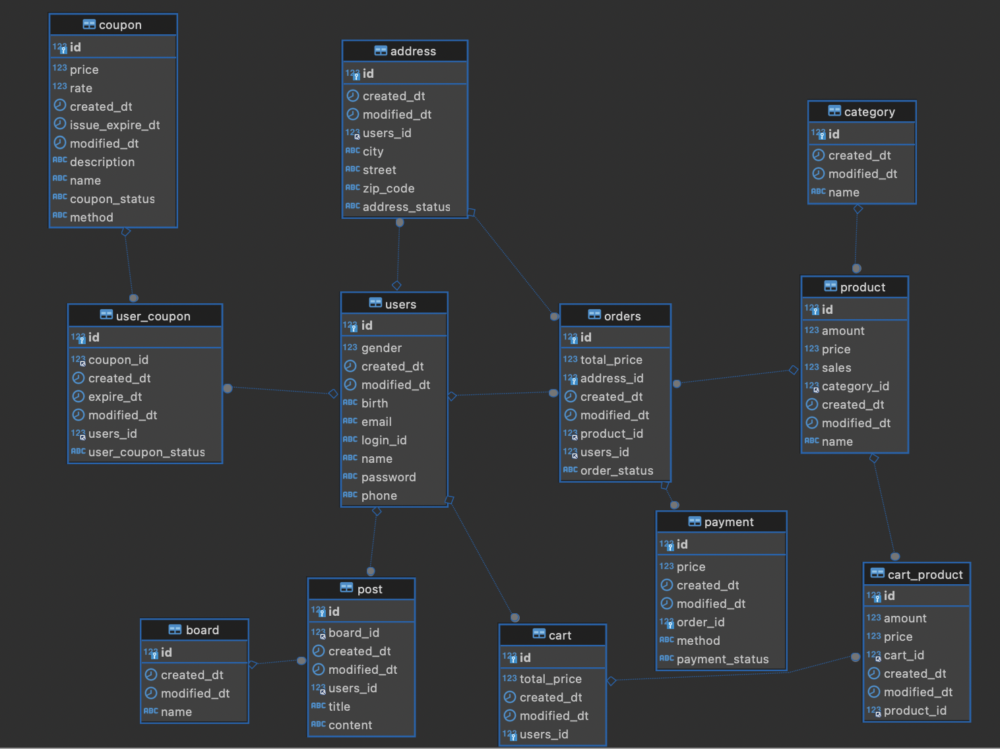

## 시작
JPA 학습을 위해 간단한 쇼핑몰 토이 프로젝트를 시작해보려고 한다.

먼저 Spring Data JPA를 사용하지 않고 개발한 후, Spring Data JPA로 업그레이드(?) 할 것이다. 말 그대로 학습을 위한 프로젝트이므로 수준이 낮을 것이다..

### 쇼핑몰인 이유?
블로그, SNS 등 생각해봤는데 가장 무난하고 테이블간의 관계가 명확한 시스템이 쇼핑몰이라고 판단했다. 단순하게 주문, 사용자, 상품만 있어도 핵심 도메인에는 문제 없지만 쿠폰, 장바구니, 게시판 등을 추가해서 정말 조금이라도 복잡한 시스템을 만들어보고자 한다.

## 테이블 설계

우선 처음 구상하면서 생각한 테이블 ERD 이다. MySQL이 자동으로 만들어준 ERD라 구체적인 연관관계가 잘 보이지 않는다..
간단한 프로젝트를 만들려고 했지만 생각보다 테이블이 많아졌다.

초기 단계 설계이므로 언제든지 바뀔 수 있다. 

## TDD를 할 것인가
고민 중인 것이 TDD도 연습할 것인지이다.
해당 프로젝트를 진행하는 이유가는 JPA를  학습하려는 것인데 어차피 JPA 뿐만 아니라 컨트롤러 서비스 리포지토리도 모두 구현해야한다. 그렇다고 TDD에 너무 신경쓰다보면 원래 목적을 잃을 것 같다는 생각도 든다.

나는 테스트코드의 중요성을 많이 느끼고 있다. 현재 회사는 SI성으로 개발하기 때문에 테스트코드를 작성하지 않는다. 그러다보니 단위 테스트(화면테스트)할 때 이런저런 버그가 자주 발생하고, 에러가 없는 줄 알았는데 나중에 보니 에러가 발생하는 코드였던 적이 많았다.
그래서 내가 새로운 도메인을 개발해야하는 경우, 아무도 안하지만 혼자서 TDD로 개발해본 적 있다. 물론 눈치보여서 커밋도 못 하고 내 로컬에만 있다 🤣  확실히 테스트코드가 있으니 리팩터링하거나 기능을 수정, 추가할 때 너무 편했다. 믿는 구석이 있으니 더 이상 에러를 걱정하며 커밋할 필요가 없어졌다. 하지만 혼자서 TDD로 개발한다는 것은 한계가 있었고, 실무에서 적용하기가 어려웠다.

얘기가 갑자기 다른 곳으로 샜는데
우선 서비스 코드에 대해서만 TDD로 작성해볼까 싶다. 아니면 최대 리포지토리까지만..? 컨트롤러 테스트하려면 프로젝트의 비중이 JPA가 아니라 TDD 쪽으로 넘어갈 것 같다.

## 화면개발
화면은 최대한 단순하게 할 생각이다. 나는 취준 초반에 프론트엔드를 지망했기 때문에 기본적인 자바스크립트와 html, css는 할 수 있다. 리액트와 Vue도 공부했었는데 그것까지 넣기에는 본질이 흐려질 것 같았다. 간단하게 Thymeleaf로 구현하려고 한다. 디자인은 별로 대애충..

