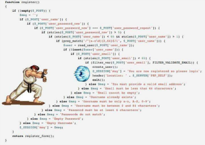

## 들어가며
2023년 4월 4일 신입으로 입사하여, 이틀 전 나는 입사 1주년이 되었다. 개발자로서의 신입뿐만 아니라 알바를 제외하고 직장을 다닌 것 자체가 신입이다.

경력이 1년이 되니, 뭔가 조금한 마음이 생겼다. 

> 1년차인데 나 정도면 어느 정도 수준일까? 이 회사를 계속 다녀도 되는걸까?

회고록을 작성한다고 해서 이 문제들의 해답을 찾을 수는 없겠지만, 작성함으로써 내가 잘한 것과 반성하고 고쳐야할 점 등에 대해 상기해보고 2년차 개발자가 돼보려고 한다.

## 취업 준비
### 상경
2023년 3월1일에 서울에 올라왔다. 취업준비는 고향인 부산에서 계속 하고 있었고 서울에 먼저 취직한 친구집에 잠시 얹혀살았다. 그 때에 나는, 카카오뱅크 비상금대출로 300만원 한도를 모두 사용했고 더 이상 수입이 될만한 소스가 없어서 무척 힘들었다. 다행히 친구가 밥도 차려주고 이것저것 잘 챙겨주고 도와줘서 그 시기를 잘 버틸 수 있었다. TMI로 당시 친구의 자취방은 신논현역 근처에 있었다. 몰랐는데 신논현역 근처가 되게 유흥가였다.

### 취직
앞서 말했듯이 면접을 위해 서울에 올라왔을 당시 돈이 매우 없었다. 경제적으로 여유가 없으니 당연히 심적인 여유도 없었다. 친구가 출근하면 집에 홀로남아 친구 책상에서 공부했다. 심지어 서울에 올라오기 전 서류합격했던 4군데의 회사는 모두 면접에서 탈락했다. 점점 더 조급해졌다.
그리고 그 때가 코로나 이후로 금리가 오르면서 IT 투자 역시 줄어들고 있었다. 때문에 채용시장 역시 많이 얼어붙었다. 여러 회사들은 구인을 하는 것이 아니라 기존에 다니고 있는 직원들을 정리하기 바빴다. 

이렇게 경제적 + 사회적 문제들로 인해 마음에 들진 않지만 일단 붙여준 회사에 덜컥 가버렸다. 그 회사가 지금의 다니는 회사인데, 회사는 나름 잘 돌아가고 있고 중소기업치고 보상이 좋다.

## 입사
### 면접과 합격
사실 지금 다니는 회사는 '붙어도 절대 안 가야지...' 하는 회사였다. 회사에 대한 비전이나 어떤 환경보다는, 그냥 면접 경험이 마음에 들지 않았다. 조금만 얘기하자면, 면접 때 기술적인 질문이 거의 없었던 걸로 기억한다. 다른 회사들은 각자 노트북을 가져와서 내 이력서와 깃허브, 블로그 등을 보며 거기에 대한 얘기와, 기술적인 질문들을 주로 했다. 하지만 우리 회사는 내가 취준하며 열심히 준비했던 것들을 하나도 물어보지 않았다. "파이썬은 좀 할 줄 알아요?" (다행히 1년동안 파이썬을 손댈 일은 없었다.), "입사하면 분당에 가야할 수도 있는데 괜찮아요?" 정도 물어보고, 내가 자기소개하는데 두 분은 휴대폰만 보고 계셨다. 내 기억 상 면접이 10분? 정도안에 끝났던 것 같다. 그러고는 다음 면접자가 대기하고 있었다.

> 내가 열심히 준비한 내 이력서와 포트폴리오 등이 의미없는 산출물 되어버렸다.

심지어 면접을 들어온 세 분 중 두 분은 IT 직종도 아니셨고, 한 분 역시 실무 개발자가 아니라 임원이셨다. 기술면접이 없고 인성면접만 본 셈이다.

이 글을 읽은 다른 사람들은 어떻게 느낄 진 모르겠지만, 나는 정말 면접 인상이 안 좋았다. 그래서 붙어도 절대 안 가야지.. 했다.

**그런데 정말 붙었다.** 문제는 제시한 연봉이 내가 주워들은 중소기업 개발자 신입 연봉을 많이 상회했다. 이 때, 정말정말 고민을 많이 했다. 이 회사는 분명 내가 생각하는 개발과 개발문화를 가지고 있지 않을 거라는 생각이 가득 찼기 때문이다. 하지만 그 당시 나의 상황과 사회적 상황이 너무나 안 좋았기 때문에, 다들 취직을 한 다음 이직을 노려라는 얘기를 했다. 나 역시 그게 더 나은 선택일 수 있다고 생각했고, 지금의 1년차 개발자가 되었다.

### 신입으로 입사
#### OJT
입사 당일, 나와 같이 입사한 사람이 나 포함 6명이었다. 다같이 회사 방침이나 복지 등 이런저런 OJT를 들었다. (이 중 2명은 일주일만에 퇴사했다.) 그리고 OJT가 모두 끝나고 나는 충격적인 소식을 듣게되었다. 다음 날부터 당장 분당에 있는 KT 본사에 가야했다. 나는 사실 분당이 어딘지도 잘 몰랐다. 서울 지리도 잘 모르는데 분당이라니....

다행히 친구집(신논현)에서 수직으로 버스나 지하철을 타고 내려오면 분당이었다. 출퇴근은 나름 수월했다.

#### 파견 첫날 폭우...
2023년 4월 5일 KT로 첫 출근했다. 그 날 분당에 기록적인 폭우가 왔고, 거기에 있는 다리가 중 하나인 정자교가 무너졌다. 어떻게 내가 처음 가는 날 다리가 무너질 수가 있지...? 그래서 분당에서 일하던 6개월 정도 근처 다리를 지날 때마다 무서웠던 기억이 있다.

이 사고에 사상자가 계셔서 정말 마음이 아픈 사고였다.

#### 업무
처음 간 날, 거기 계신 이사님과 커피챗을 가졌다. 내가 할 일은 webix.js 라는 라이브러리로 화면을 만드는 것이었다.....

나는 프론트엔드를 준비하다가 도저히 안 맞아서 백엔드로 전환을 한 케이스이기 때문에 화면 작업 하기를 극도로 꺼려했다. 하지만, 나 같은 신입에게 백엔드를 맡길 순 없다고 생각한 회사의 선택이었을 것이다. 백엔드 자리에는 지금도 나와 잘 지내는 과장님이 오셨다. 

프론트 준비할 때에 React, Vue, Angular, Next 등 많은 라이브러리 및 프레임워크를 들어봤지만, webix는 처음 들어봤다. 회사 사람들에겐 미안하지만 정말 **아차** 싶었다. 개발자는 첫 회사 중요하다 아니다가 많이 갈리지만, 나는 중요하다는 쪽의 의견이다. 그래서 정말 큰 일 났다 싶었다. 더 심각한 것은, 개발환경이 지원 중단된 지 오래된 InternetExplorer 였고, SVN으로 형상관리를 하는 것이었다. 사실 IE에 비하면 SVN은 편하고 양반이었다. 근데 IE는 정말 너무 불편했다. 디버깅도 잘 안될 뿐더러 ES6 이상의 자바스크립트 문법을 사용할 수 없었기 때문에 예상치 못한 곳에서 계속 호환성 관련 문제가 발생했다.

어찌됐건 정말 하나도 모르는 라이브러리기 때문에 개발 환경이 세팅되는 동안 내 노트북으로 webix 라이브러리의 공식문서와 예제코드를 모두 연습해보며 감을 익혔다. 주변 동료들이 나 같은 사람을 처음본다고 했다.. ㅋㅋㅋ

미리 연습을 해서 그런가 나는 파견 다음 날 부터 업무를 시작했다. 
신입같지 않다는 많은 칭찬을 받으며 프로젝트는 마무리 되었다.

#### 워크숍
당시 사내 워크숍을 하지 않게되어 나와 주변에 앉아있는 모든 동료들이 자체 워크숍을 갔다. 우리는 조금씩 돈을 모으고 이사님이 사비로 진행해주셨다. 강원도 홍천이라는 곳에 있는 펜션에 갔다. 

정말 즐거운 경험이었다. 나보다 어린 사람들도 있지만 회사에서는 내가 제일 후배이기 때문에 편하게 놀지 못했던 점이 좀 아쉽다. 펜션에서 같이 게임도 하고, 각자 음식을 가져와서 순위도 매기고 그랬다. 바베큐 파티도 하고 정말 즐거웠다. 내 인생에 두 번 다시 있을까? 싶은 정말 좋은 추억이자 경험이었다.

잊지못할 좋은 추억을 만들어주신 당시 KT에서 근무하던 모든 동료 및 이사님에게 감사의 말씀을 올린다.

## 두 번째 프로젝트
이 쯤되면 우리회사는 SI회사라는 것을 눈치챘을 것이다. 그런데 전형적인 SI는 아닌 것 같고, 음성 AI 서비스 관련해서 통신사나 금융권 위주로 프로젝트를 진행한다. 다음 프로젝트는 지금도 진행중인 프로젝트이다.

지금 하고 있는 9월 말에 투입되었는데, 이미 진행 중인 프로젝트였다. 실제 프로젝트의 시작일은 2월 쯤이었다고 한다. 다른 회사의 솔루션을 받아, 버그를 수정하고 고도화하고 기능을 추가하여 고객사에 설치를 해야했다. 때문에 바퀴를 갈아껴야하는데 자동차도 아니고 그냥 기차도 아닌 KTX 수준이었다. 계약된 프로젝트 자체의 기한이 임박한 것은 아닌데, 고객사에 설치하는 기한이 너무 임박했다. 설계도 뭣도 제대로 되어있지 않았고 정말 허허벌판에서 개발했다. 나는 지금 우리 회사 본사에서 근무 중인데, 발주사는 보안이 중요한 회사여서 소통도 힘들고 정보도 정말 빈약했다. 심지어 운영환경에서 실제로 어떻게 동작하는 지 볼 수도 없고 디버깅도 할 수 없다. 정말 마음으로 개발했다.

다행히 이번 프로젝트는 프론트, 백을 나누지 않고 기능별로 할 일을 나눴다. 그 덕에 나는 화면부터 서버, DB 등 다양한 부분을 담당하고 리팩터링도 해볼 수 있었다.

### 꼼꼼한 테스트
이번 프로젝트를 진행하며 내 문제점을 발견했다. 테스트를 집요하게 하지 않는다는 것이다. 내 생각에 나는 디버깅 속도가 빠르다. 따라서 어떤 일이 주어지면 문제를 빨리 찾고 빨리 해결한다. 그러고는 다 했다고 보고한다.

**문제는 테스트를 대충한다는 것이다.** 지금 프로젝트는 테스트코드를 1도 작성하지 않는다. 따라서 테스트를 할려면 코드가 아니라 서버를 띄워서 내가 수정한 부분이 정상적으로 작동하는 지를 확인해봐야 한다. 이 때, 이런 상황 저런 상황에 대한 테스트를 해봐야 하는데 나는 정말 간단한 테스트만 해보고 다 했다고 한다.
그러다보니, 실제로 코드가 배포되었을 때나 남들이 봤을 때 버그가 발생한 적이 꽤 있었다.

어디선가 들었는데, 개발을 다 했다고 하려면 테스트까지 포함이라고 한다. 이 말을 언제부턴가 새겨듣고, 최근에는 테스트를 다방면에서 다 해보고 다 했다고 얘기한다.

이런 이유로 테스트 코드의 중요성을 정말 피부로 느끼고 있다. 내  부족함을 조금이나마 줄이기 위해 NEXTSTEP 에서 진행하는 TDD를 하고 있다.

### 자율
이번 프로젝트는 나에게 꽤나 큰 자율성을 주었다. 내가 말하는 자율성은 어떤 개발 툴에 대한 선택이나 인프라 구축등의 넓은 범위는 아니다. 객체지향에서 객체는 자율적이어야한다고 한다. 객체에게 메시지를 요청하면 객체가 어떻게 하든 원하는대로 되기만 하면 된다. 내가 말한 자율은 객체의 자율과 같다.

이런 환경에서 나는 코드에 대한 고민을 굉장히 많이 했다. 너무 자랑같지만, 나는 타자도 나름 빠르고 문제 해결하는 게 빨라서 항상 시간이 남았다. 그 시간에 코드에 대한 고민을 엄청나게 했다. 

기존 코드는 정말정말 일관성없고 레거시 했다.
매우 유명한 밈과 흡사했다.

(진짜 이런식이다..)

이렇 듯 기존 코드가 너무 레거시하고 스파게티 코드라서 리팩터링하는 것과 쿼리 시간 줄이기, 객체(컴포넌트)로 도출하기, AOP 도입해보기 등 내가 해볼 수 있는 게 많았다. 현재 다루는 스프링부트 프로젝트가 4개 이상이고 각각이 워낙에 커서 모든 코드를 개선하진 못하지만 정말 복잡한 코드들을 꽤 개선했다.

테스트 코드가 없는 리팩터링은 정말 도박이다. 다행히 나의 리팩터링은 항상 승리하는 도박이었다. 리팩터링 후에 테스트 코드가 없지만 화면에서 테스트를 꼼꼼히 했다.

또, 블로그에 올린 로컬 수동 배포 자동화같은 일도 했다.

### 칭찬
이번 프로젝트에 와서 칭찬을 많이 받았다. 가끔 혼도 났지만 대체적으로 나를 신뢰하신다. 내 블로그니까 자랑 좀 하겠다.

> "우리에겐 OO(나)씨가 있다", "1년차 개발자 중에 5% 안에 든다.", "웬만한 대리보다 낫다.", "OO씨는 개발 쭉 해도 될 것 같다.", "OO씨가 차세대 리더다.. 아니 지금도 리더다".

오글거리니까 이쯤하겠다. 과장, 부장, 이사님께서 해주신 말씀이다. 들을 때마다 정말 겸손하게 그 정돈 아니라고 말씀드리지만, 정말 감사하다. 프로젝트를 진행하며 이런 저런 실수와 에러를 많이 냈지만, 저렇게 말씀해주시고 믿어주시는 것도 정말 감사하다.

### 그런데 진짜 잘 하고 있는걸까?
나는 두뇌회전이 나름 꽤 빨라서 문제를 찾고 해결하는 것이 빠르다. 그러다보니 종종 뭔가를 간과하게 된다. 아까 말했 듯 테스트를 꼼꼼히 하지 않거나, 뭔가 예외 하나를 빠져먹거나...
나는 그럴 때마다 스스로가 정말 아쉽고 책망하게 된다. 

또, 내가 지금 도메인을 제대로 이해하고 있는건 지 모르겠다. 코드적인 흐름은 웬만하면 알고 있는데, 요구사항적인 것들은 자꾸 잊게된다. 가령, DB에 넣을 데이터를 암복호화 하는 요구사항이 있는데 이게 자꾸 바뀌다 보니 결과가 어땠는 지 자꾸 까먹는다. 그래서 여기는 암호화를 하랬나 저기는 하지말랬나 기억이 잘 안난다. 
개인적으로 이렇게 요구사항을 잘 숙지하고 도메인에 대해 잘 이해해야 더 경쟁력있는 개발자가 될 수 있다고 생각한다. 내가 **아무리 문제해결을 빨리 해봤자 ChatGPT의 눈꼽만큼도 못 따라갈 것이다.**

## 마무리
이제 회고록을 마무리하려고 한다. 생략한 부분이 많지만 내 365일을 모두 작성할 순 없으니 꽤 중요한 것, 아쉬웠던 것, 좋았던 것 등만 회고했다. 이렇게 돌이켜보니 꽤 긴 시간이었다. 회고라는 것을 인생 처음 작성해보는데, 각 잡고 기억하려니 기억이 잘 난다. 요즘 이런 저런 공부하느라 다른 게 머리에 잘 안 들어오는데, 내 인생을 기억하고 반성하고 되새기는 날도 꼭 필요할 것 같다. 내 인생을 나 말고 누가 기억해주나?

나의 좌충우돌 신입 1년이 이렇게 마무리되었다. 아무래도 경력이 쌓이다보니 매일매일 조금씩 조급함이 ++ 된다. 그 조급함을 조금은 놓아주고 블로그 이름처럼 **여유로운 개발생활**을 즐겨보자. 내 인생 처음이자 마지막 신입. 고생많았다. 올 해도 파이팅!